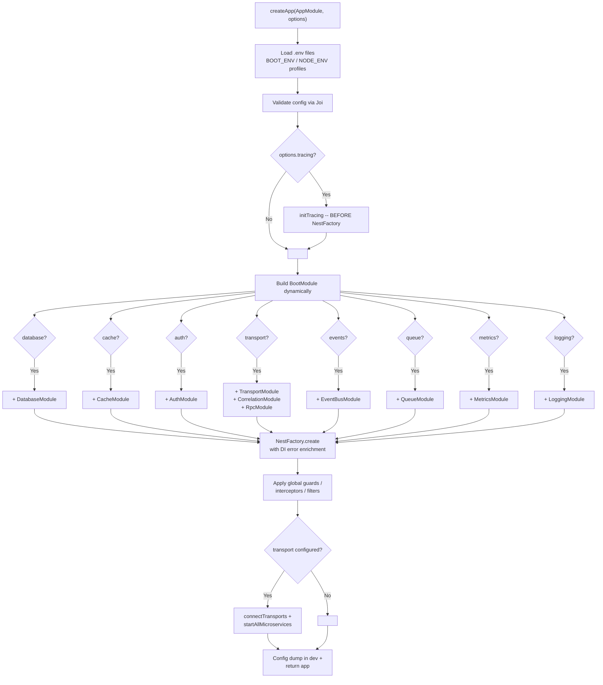

# nestjs-boot

> Production-ready NestJS microservice framework. One config object, zero wiring.

[](https://www.npmjs.com/package/nestjs-boot)
[](https://opensource.org/licenses/MIT)
[](#)
[](#modules)

## What is nestjs-boot?

`nestjs-boot` is a **runtime package** (not a template or boilerplate). Install it as a dependency, call `createApp(AppModule, config)`, and it auto-wires databases, cache, auth, transports, queues, events, health checks, metrics, tracing, and more -- based on what you configure. Every module is optional: omit a config section and that module is not loaded. Your `AppModule` stays clean with only business logic.

## Getting Started

### Option 1: Create a new project (interactive CLI)

```bash
npx nestjs-boot new my-service
cd my-service
npm install
npm run start:dev
```

The CLI prompts for database (MongoDB, PostgreSQL, MySQL, DynamoDB, Elasticsearch), cache (Redis, Memcached), auth (JWT), and transport (HTTP, gRPC, TCP, NATS, RabbitMQ). Or pass flags:

```bash
npx nestjs-boot new my-service --db=postgres --cache=redis --auth=jwt --transport=grpc
npx nestjs-boot new my-service -y  # defaults: MongoDB + Redis + JWT + HTTP
```

Test it:

```bash
curl http://localhost:3000/health       # health check
curl http://localhost:3000/metrics      # Prometheus metrics
```

### Option 2: Run the 10-service example

```bash
git clone https://github.com/nthanhdo/nestjs-boot.git
cd nestjs-boot/examples/microservices
docker-compose up --build
```

Starts 10 services + MongoDB + Redis communicating via gRPC. See [examples/microservices/](examples/microservices/).

## Architecture


## `createApp()` -- How It Works

**Before** -- manual wiring (~40 lines of infrastructure per service):

```ts
@Module({
  imports: [
    MongooseModule.forRootAsync({ connectionName: 'master_writer', useFactory: () => ({ uri: '...' }) }),
    MongooseModule.forRootAsync({ connectionName: 'master_reader', useFactory: () => ({ uri: '...' }) }),
    CacheModule.register({ store: redisStore, url: '...' }),
    ConfigModule.forRoot({ validationSchema: Joi.object({ /* ... */ }) }),
    TerminusModule.forRoot(),
    // + interceptors, filters, health indicators ...
  ],
})
export class AppModule {}
```

**After** -- one config object in `main.ts`:

```ts
import { createApp } from 'nestjs-boot';
import { AppModule } from './app.module';

const app = await createApp(AppModule, {
  database: {
    connections: {
      master: { writerUri: process.env.MONGO_URI!, readerUri: process.env.MONGO_READER_URI },
    },
  },
  cache: { redis: { url: process.env.REDIS_URL! }, defaultTtl: 300 },
  auth: { jwt: { secret: process.env.JWT_SECRET! } },
  health: { enabled: true },
  response: { envelope: true },
});

await app.listen(3000);
```

### Boot Sequence



## Modules

### Database

Multi-connection MongoDB with automatic reader/writer split. `BaseRepository<T>` provides CRUD + pagination with automatic connection routing. `CachedBaseRepository<T>` adds cache-aside on top. `CrudService<T>` provides lifecycle hooks (`beforeCreate`, `afterCreate`, etc.). `UnitOfWork` supports MongoDB transactions. `Specification<T>` enables composable query filters.

**Migrations:** `MigrationRunner` with `_migrations` collection tracking state. CLI: `npx nestjs-boot migrate`, `migrate:create`, `migrate:rollback`, `migrate:status`.

```ts
database: {
  connections: {
    master: { writerUri: 'mongodb://primary:27017/app', readerUri: 'mongodb://replica:27017/app' },
    analytics: { writerUri: 'mongodb://analytics:27017/metrics' },
  },
}
```

### Cache

L1 in-memory LRU + optional L2 Redis. Size-aware routing (>1MB goes to L2 only). Optional Memcached adapter for L1. `MultiCacheService` provides `getOrSet()`, `del()`, `delByPrefix()`.

**Advanced:** `CacheStampedeGuard` (prevents thundering herd -- only one request hits DB when cache expires), `CacheWarmer` (pre-warms cache at startup), `TaggedCacheService` (invalidate by tag), `CacheStats` (hit rate statistics).

```ts
cache: { redis: { url: 'redis://localhost:6379' }, defaultTtl: 300 }
```

### Auth

Full auth stack: JWT (access + refresh + revocation), API key validation, RBAC (`@Roles`, `@Permissions`), `@Public()` bypass, `@CurrentUser()` extraction.

**Social/OAuth2:** `SocialAuthModule` with `GoogleStrategy` and `GitHubStrategy` out of the box.
**TOTP:** `TotpService` for 2FA (generate secret, verify token).
**Session:** `SessionAuthModule` with pluggable `SessionStore` and `@Session()` decorator.
**WebSocket:** `WsJwtGuard` for authenticated WebSocket connections.

```ts
auth: {
  jwt: { secret: '...', refreshSecret: '...', refreshExpiresIn: '7d' },
  apiKey: { enabled: true, validate: async (key) => isValid(key) },
  rbac: { enabled: true },
}
```

### Transport

Config-driven hybrid HTTP + gRPC/TCP/NATS/RabbitMQ. `ServiceClient<T>` provides type-safe RPC calls with auto correlation-ID forwarding. `createResilientClient()` wraps clients with circuit breaker + retry. `ServiceDiscoveryHook` enables dynamic service resolution.

```ts
transport: {
  grpc: { url: '0.0.0.0:5000', package: 'product', protoPath: 'product.proto' },
  clients: {
    PRODUCT_SERVICE: { transport: 'grpc', options: { url: 'product:5000', package: 'product', protoPath: 'product.proto' } },
  },
}
```

### Observability

**Metrics:** Prometheus endpoint via `MetricsModule`. Includes `HttpMetricsInterceptor`, `DbMetricsInterceptor`, `CacheMetricsInterceptor`, and `QueueMetrics` collectors.

**Logging:** Structured pino via `LoggingModule` with `BootLogger` and `LoggingInterceptor` (request timing, redaction).

**Tracing:** OpenTelemetry via `TracingModule`. `@BootTrace('name')` auto-creates spans. `initTracing()` runs before NestFactory (handled by `createApp`).

**Correlation:** `X-Correlation-Id` propagated across services via `AsyncLocalStorage`. Use `getCorrelationId()` / `setCorrelationId()` anywhere.

```ts
metrics: { enabled: true, path: '/metrics', prefix: 'myapp_' },
logging: { level: 'info', pretty: true, redact: ['req.headers.authorization'] },
tracing: { exporter: 'otlp', endpoint: 'http://jaeger:4318', sampleRate: 0.1 },
correlation: { header: 'X-Correlation-Id' },
```

### Resilience

`@CircuitBreaker()` wraps methods with closed/open/half-open state machine. `@Retry({ attempts: 3, backoff: 'exponential' })` adds automatic retries. `@Timeout(5000)` enforces per-method deadlines via `TimeoutInterceptor`.

```ts
resilience: { circuitBreaker: { failureThreshold: 5, resetTimeout: 30000 }, timeout: { default: 5000 } }
```

### Error Handling

`AllExceptionsFilter` for structured HTTP errors. `BootRpcExceptionFilter` for gRPC with HTTP-to-gRPC status mapping. `BootException` adds stable `code` + `details` fields. `MongooseErrorInterceptor` transforms duplicate-key and validation errors. `toProblemDetails()` outputs RFC 9457. `ErrorReporter` hooks into Sentry/Datadog. `errorBoundary()` wraps async calls with fallback.

```ts
throw new BootException('Not found', { code: ErrorCodes.NOT_FOUND, status: 404 });
```

### Queue & Events

**Queue:** BullMQ job processing with `@Processor`, `@Process`, `@OnFailed`, `@OnCompleted` decorators. `QueueService.addJob()` to enqueue.

**Events:** In-process or Redis pub/sub event bus. `BootEvent` for fire-and-forget. `BootQuery` for request/response (`emitAndWait`). `@OnEvent()` and `@OnQuery()` handler decorators.

```ts
queue: { driver: 'bullmq', redis: { url: 'redis://localhost:6379' } },
events: { transport: 'redis', redis: { url: 'redis://localhost:6379' } },
```

### CQRS & Event Sourcing

- **CommandBus:** 1:1 command-to-handler routing via `@CommandHandler`.
- **AggregateRoot:** DDD pattern with `apply()`, `loadFromHistory()`, version management.
- **EventStore:** MongoDB + memory adapter, interface for EventStoreDB/Kafka.
- **Projection:** `@OnDomainEvent` builds read models automatically when streaming.
- **Outbox:** Writes events to DB in the same transaction, publishes asynchronously -- guarantees at-least-once delivery.
- **Saga:** `defineSaga()` builder with reverse compensations.

```ts
cqrs: { eventStore: 'mongodb', outbox: { enabled: true } }
```

### Multi-tenancy

3 isolation strategies: row-level (shared collection, filter by `tenantId`), schema-level (prefixed collections), database-level (separate connection per tenant). `TenantAwareRepository` auto-scopes queries. `@CurrentTenant()` decorator.

```ts
tenancy: { strategy: 'header', isolation: 'row' }
```

### API Versioning

URI / header / media-type versioning. `@DeprecatedVersion('2027-01-01')` adds a Sunset header.

```ts
versioning: { type: 'uri', defaultVersion: '1' }
```

### Swagger/OpenAPI

Auto-configured from `package.json`. Adds auth schemes when AuthModule is configured. `@ApiPaginated`, `@ApiErrorResponses`, `AutoApiProperties()`. Enabled by default in dev, disabled in prod.

```ts
swagger: { enabled: true, path: '/docs' }
```

### WebSocket

Redis adapter for multi-instance scaling. `BootWsGateway` base class. `WsCorrelationInterceptor` attaches correlationId to every message. Supports Socket.IO (default) or native `ws`.

```ts
websocket: { adapter: 'socket.io', redis: { url: 'redis://localhost:6379' } }
```

### Payments & Webhooks

Stripe/PayPal signature verification (HMAC-SHA256). `IdempotencyGuard` prevents duplicate processing. Custom providers via interface. Requires `rawBody: true` on NestFactory.

```ts
webhooks: { providers: { stripe: { secret: process.env.STRIPE_WEBHOOK_SECRET! } } }
```

### File Storage

Driver abstraction: `local` (zero deps) | `s3` (requires `@aws-sdk/client-s3`) | `gcs` (requires `@google-cloud/storage`). `FileValidationPipe` checks mime + size before upload. `getSignedUrl()` for temporary URLs.

```ts
storage: { driver: 's3', s3: { bucket: 'my-bucket', region: 'us-east-1' } }
```

### Alerts

Multi-channel alert notifications: Console, Webhook, Slack, Discord, PagerDuty. `AlertService` evaluates `AlertRule` conditions and dispatches `AlertPayload` to configured channels. Pluggable `AlertChannel` interface for custom integrations.

```ts
alerts: {
  channels: [{ type: 'slack', webhookUrl: process.env.SLACK_WEBHOOK! }],
  rules: [{ metric: 'error_rate', threshold: 0.05, channels: ['slack'] }],
}
```

### Deploy

Deploy lifecycle hooks: `@OnDeploy('pre-start')` registers phase-aware hooks. Built-in hooks: `EnvValidationHook` (validates required env vars), `DependencyCheckHook` (verifies external service connectivity), `ReadinessGateHook` (blocks traffic until ready). `DeployService` orchestrates hooks in `DEPLOY_PHASE_ORDER`.

```ts
deploy: { hooks: [EnvValidationHook, DependencyCheckHook, ReadinessGateHook] }
```

### Config

Joi validation, `.env` + `.env.{BOOT_ENV}` profiles, `BootConfigService` with typed dot-notation access. Async loading via `BootConfigModule.registerAsync()`. Secret adapters: `AwsSecretsAdapter`, `VaultAdapter`, `EnvFileAdapter`. `mergeConfigs()` for multi-source composition. `ConfigWatcher` for dev hot-reload. `generateConfigDocs()` outputs config schema docs.

```ts
BootConfigModule.registerAsync({
  useFactory: async (vault) => ({ database: { connections: { master: { writerUri: await vault.get('MONGO_URI') } } } }),
})
```

### Health

Auto-detects configured drivers (MongoDB, Redis) and registers `@nestjs/terminus` health indicators. Returns 503 during graceful shutdown.

```ts
health: { enabled: true, path: '/health' }
```

### Graceful Shutdown

`ShutdownModule` drains in-flight requests, closes database connections, flushes queues. K8s-aware with configurable pre-stop delay.

```ts
shutdown: { timeout: 10000, signals: ['SIGTERM', 'SIGINT'] }
```

### Inter-Service Auth

Propagates auth context (JWT, API keys) across service boundaries via `AsyncLocalStorage`. `AuthPropagationInterceptor` captures incoming auth. `getAuthContext()` / `buildAuthHeaders()` for manual propagation.

```ts
interServiceAuth: { propagation: true, serviceToken: 'internal-service-secret' }
```

### DI Safety

**Error enrichment:** `parseDiError()` + `formatDiError()` turn cryptic Nest DI errors into actionable fix suggestions.

**Contracts:** `createContract<T>()` defines interface-based DI tokens. `provideContract()` / `provideContractFactory()` bind implementations. `validateContracts()` catches missing bindings at startup.

**Graph analysis:** `analyzeModules()` walks the module tree. `detectCycles()` finds circular dependencies via Tarjan's SCC. `renderMermaid()` outputs a visual diagram.

**Layer enforcement:** `@Layer(ModuleLayer.INFRASTRUCTURE)` decorator + `validateLayers()` prevents upward dependencies (infra importing application).

### Testing

`createTestSuite(options)` -- full lifecycle manager (setup/teardown, module compilation, cleanup). `createFactory<T>(defaults)` -- data factories with traits, sequences, and `afterCreate` hooks. `createTestClient(app)` -- supertest wrapper with typed responses. `createGrpcTestClient()` -- gRPC service testing. `createMessageDispatcher()` -- microservice message testing. `ContractVerifier` -- verify gRPC contracts against proto files. `expectSnapshot()` + `stripVolatileFields()` -- deterministic snapshot testing. `seedDatabase()` / `cleanDatabase()` -- test data lifecycle. `createTestJwt()` + `MockAuthModule` -- auth test helpers.

```ts
const suite = createTestSuite({ imports: [AppModule] });
const app = await suite.compile();
const client = createTestClient(app);
await client.get('/products').expect(200);
await suite.teardown();
```

## CLI Commands

### `npx nestjs-boot new <name>`

Interactive project scaffolding. Supports 5 database types, cache, auth, and 5 transport options.

```bash
npx nestjs-boot new my-service              # interactive prompts
npx nestjs-boot new my-service --grpc       # with gRPC transport
npx nestjs-boot new my-service -y           # all defaults
npx nestjs-boot new my-service --db=postgres --cache=memcached --transport=nats
```

### `npx nestjs-boot g resource <name>`

Generate a CRUD resource (module, controller, service, schema, DTOs):

```bash
npx nestjs-boot g resource product          # full CRUD resource
npx nestjs-boot g resource product --minimal  # minimal scaffold
```

### `npx nestjs-boot graph`

Visualize module dependency graph. Detects circular dependencies.

```bash
npx nestjs-boot graph                       # Mermaid diagram to stdout
npx nestjs-boot graph --strict              # exit 1 if cycles found (CI gate)
npx nestjs-boot graph --format=json         # JSON output
npx nestjs-boot graph --output=graph.md     # write to file
```

## Full Config Reference

```ts
interface BootOptions {
  database?: {
    connections: Record<string, {
      writerUri: string;
      readerUri?: string;
      options?: MongooseConnectionOptions;
    }>;
  };
  cache?: {
    redis?: { url: string };
    memcached?: { servers: string };
    defaultTtl?: number;                    // seconds (default: 300)
  };
  response?: {
    envelope?: boolean;                     // wrap in { statusCode, message, data }
    errorHandler?: boolean;                 // global AllExceptionsFilter (default: true)
  };
  health?: {
    enabled?: boolean;                      // default: true
    path?: string;                          // default: '/health'
  };
  auth?: {
    jwt?: {
      secret: string;
      signOptions?: { expiresIn?: string | number; algorithm?: string };
      refreshSecret?: string;
      refreshExpiresIn?: string | number;
    };
    apiKey?: { enabled: boolean; validate: (key: string) => Promise<boolean> };
    rbac?: { enabled: boolean };
  };
  transport?: {
    grpc?: { url: string; package: string | string[]; protoPath: string | string[] };
    tcp?: { host?: string; port?: number };
    nats?: { url: string; queue?: string };
    rabbitmq?: { urls: string[]; queue: string };
    clients?: Record<string, { transport: string; options: object }>;
  };
  events?: {
    transport: 'memory' | 'redis';
    redis?: { url: string };
  };
  queue?: {
    driver: 'bullmq';
    redis: { url: string };
    defaultOptions?: {
      attempts?: number;
      backoff?: { type: 'exponential' | 'fixed'; delay: number };
      removeOnComplete?: boolean | number;
      removeOnFail?: boolean | number;
    };
  };
  correlation?: { header?: string; generator?: () => string };
  metrics?: { enabled?: boolean; path?: string; prefix?: string; defaultMetrics?: boolean };
  logging?: { level?: string; pretty?: boolean; redact?: string[] };
  tracing?: { exporter: 'otlp' | 'jaeger' | 'zipkin' | 'console'; endpoint?: string; sampleRate?: number };
  resilience?: {
    circuitBreaker?: { failureThreshold?: number; resetTimeout?: number };
    timeout?: { default?: number };
  };
  shutdown?: { timeout?: number; signals?: string[] };
  interServiceAuth?: { propagation?: boolean; serviceToken?: string };
  monitoring?: {
    errorReporter?: (error: Error, context: Record<string, unknown>) => void;
  };
  logger?: boolean | unknown;
  versioning?: {
    type: 'uri' | 'header' | 'media-type';
    defaultVersion?: string;
  };
  tenancy?: {
    strategy: 'header' | 'subdomain' | 'path';
    isolation: 'database' | 'schema' | 'row';
  };
  swagger?: {
    enabled?: boolean;                       // default: true in dev, false in prod
    path?: string;                           // default: '/docs'
    title?: string;
  };
  websocket?: {
    adapter?: 'socket.io' | 'ws';
    redis?: { url: string };
  };
  webhooks?: {
    providers: Record<string, { secret: string }>;
  };
  storage?: {
    driver: 'local' | 's3' | 'gcs';
    local?: { root: string };
    s3?: { bucket: string; region: string };
    gcs?: { bucket: string; projectId: string };
  };
  cqrs?: {
    eventStore: 'mongodb' | 'memory';
    snapshotStore?: string;
    outbox?: { enabled: boolean };
  };
  layers?: {
    enabled?: boolean;                       // module layer enforcement
    strict?: boolean;                        // exit on violation
  };
  lazy?: boolean;                            // defer DB/cache connections until first request (serverless)
}
```

Every top-level section is optional. Omitted sections = that module is not loaded.

## Guides

Detailed documentation for specific topics:

- [Circular Dependency Prevention](docs/guides/en/circular-dependency-prevention.md) -- patterns to avoid circular imports
- [DI Best Practices](docs/guides/en/di-best-practices.md) -- contract-based DI, layer enforcement, graph analysis
- [Testing Guide](docs/guides/en/testing-guide.md) -- factories, suites, snapshots, gRPC testing, message dispatching
- [Transport Selection](docs/guides/en/transport-selection.md) -- when to use gRPC vs TCP vs NATS vs RabbitMQ
- [Auth & Rate Limiting](docs/guides/en/auth-rate-limiting.md) -- JWT lifecycle, API key rotation, guard composition
- [Production Checklist](docs/guides/en/production-checklist.md) -- health checks, shutdown, metrics, tracing, security
- [Serverless Considerations](docs/guides/en/serverless-considerations.md) -- cold start, connection pooling, stateless auth

## Examples

- **[10-service microservice architecture](examples/microservices/)** -- API Gateway + 9 services, gRPC, EventBus, BullMQ, MongoDB, Redis
- **[Learning skeleton](examples/learning/)** -- minimal starter for understanding nestjs-boot

## Tools

- **[Web Generator](packages/web-generator/)** -- interactive browser-based project generator with visual config builder
- **[Admin Dashboard](packages/admin-dashboard/)** -- visual GUI for project generation, module exploration, architecture diagrams, and interactive learning
- **[Visualize Flow](packages/visualize-flow/)** -- static animated flow diagrams for all nestjs-boot subsystems (boot, auth, cache, CQRS, observability, and more) — open `index.html` directly in a browser

## Standalone Usage

Use any module without `createApp()`:

```ts
import { DatabaseModule, CacheModule, AuthModule } from 'nestjs-boot';

@Module({
  imports: [
    DatabaseModule.register({ connections: { master: { writerUri: '...' } } }),
    CacheModule.register({ redis: { url: '...' }, defaultTtl: 600 }),
    AuthModule.register({ jwt: { secret: '...' } }),
  ],
})
export class AppModule {}
```

## Roadmap

- PostgreSQL / TypeORM database adapter
- Rate limiting module
- WebSocket transport improvements

## Optional Peer Dependencies

Install only what you use:

```bash
npm install mongoose @nestjs/mongoose        # Database
npm install ioredis                          # Redis cache
npm install memjs                            # Memcached cache
npm install bullmq                           # Queue
npm install pino pino-pretty                 # Logging
npm install prom-client                      # Metrics
npm install @nestjs/terminus                 # Health checks
npm install @opentelemetry/sdk-node @opentelemetry/api  # Tracing
npm install @grpc/grpc-js @grpc/proto-loader # gRPC transport
npm install @nestjs/microservices            # Transport module
npm install otpauth                          # TOTP 2FA
```

## Contributing

```bash
git clone https://github.com/nthanhdo/nestjs-boot.git
cd nestjs-boot
npm install
npm test           # 541 tests
npm run build      # CJS + ESM + DTS
```

## License

[MIT](LICENSE)
