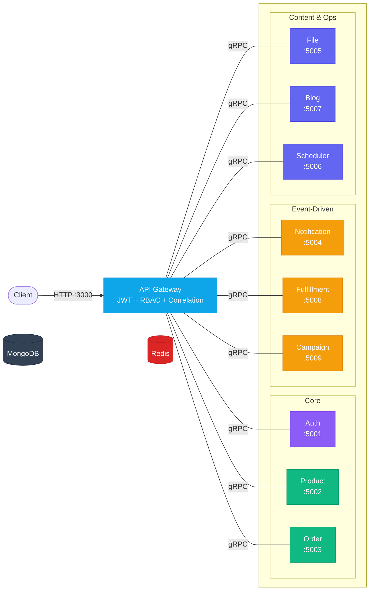
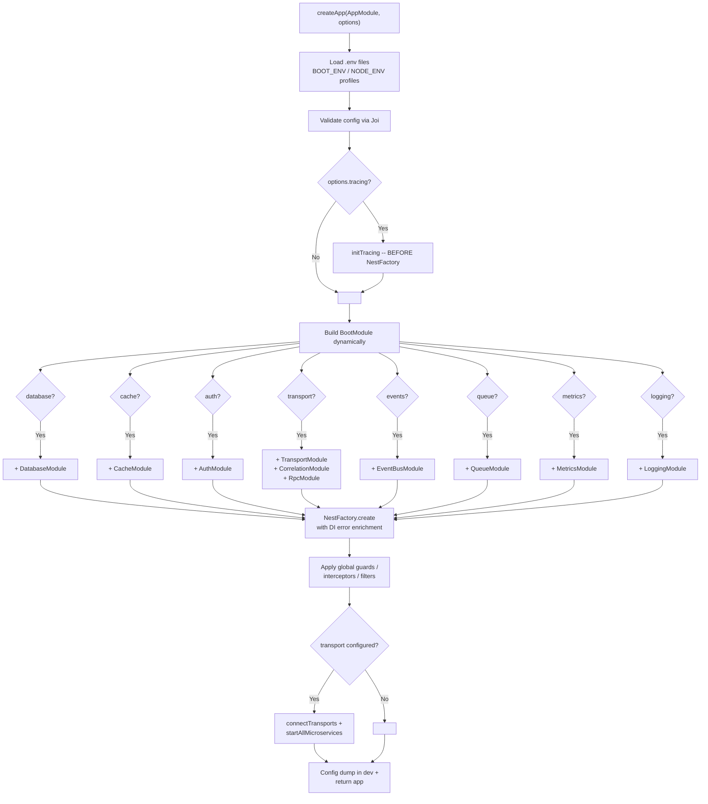
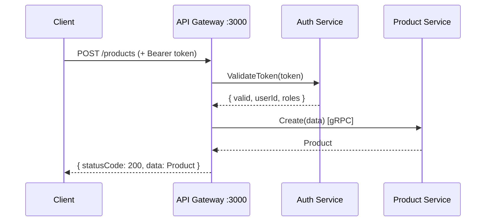
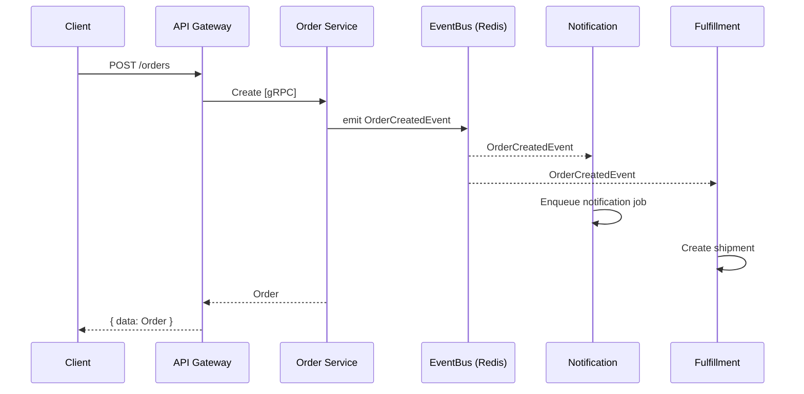

# nestjs-boot

> Production-ready NestJS microservice framework. One config object, zero wiring.

[](https://www.npmjs.com/package/nestjs-boot)
[](https://opensource.org/licenses/MIT)
[](https://github.com/nthanhdo/nestjs-boot/actions/workflows/ci.yml)
[](#)

## What is nestjs-boot?

`nestjs-boot` is a **runtime package** (not a template or boilerplate). You install it as a dependency, call `createApp(AppModule, config)`, and it auto-wires databases, cache, auth, gRPC transports, queues, events, health checks, metrics, tracing, and more -- based on what you configure. Your `AppModule` stays clean with only business logic. Every module is optional: omit a config section and that module is not loaded.

## Getting Started

### Option 1: Create a new project (interactive CLI)

```bash
npx nestjs-boot new my-service
cd my-service
npm install
npm run start:dev
```

The CLI prompts for database (MongoDB, PostgreSQL, MySQL, DynamoDB, Elasticsearch), cache (Redis, Memcached), auth (JWT), and transport (HTTP, gRPC, TCP, NATS, RabbitMQ). Or pass flags directly:

```bash
npx nestjs-boot new my-service --db=postgres --cache=redis --auth=jwt --transport=grpc
npx nestjs-boot new my-service -y  # accept all defaults (MongoDB + Redis + JWT + HTTP)
```

### Option 2: Run the 10-service example

```bash
git clone https://github.com/nthanhdo/nestjs-boot.git
cd nestjs-boot/examples/microservices
docker-compose up --build
```

This starts 10 services + MongoDB + Redis. See [examples/microservices/](examples/microservices/) for full details.

## Architecture



All 10 services communicate via **gRPC**. Each uses `createApp()` with different feature combinations. Infrastructure (MongoDB + Redis) is shared.

## `createApp()` -- How It Works

**Before** -- manual wiring (~40 lines of infrastructure per service):

```ts
@Module({
  imports: [
    MongooseModule.forRootAsync({ connectionName: 'master_writer', useFactory: () => ({ uri: '...' }) }),
    MongooseModule.forRootAsync({ connectionName: 'master_reader', useFactory: () => ({ uri: '...' }) }),
    CacheModule.register({ store: redisStore, url: '...' }),
    ConfigModule.forRoot({ validationSchema: Joi.object({ /* ... */ }) }),
    TerminusModule.forRoot(),
    // + interceptors, filters, health indicators ...
  ],
})
export class AppModule {}
```

**After** -- one config object in `main.ts`:

```ts
import { createApp } from 'nestjs-boot';
import { AppModule } from './app.module';

const app = await createApp(AppModule, {
  database: {
    connections: {
      master: { writerUri: process.env.MONGO_URI!, readerUri: process.env.MONGO_READER_URI },
    },
  },
  cache: { redis: { url: process.env.REDIS_URL! }, defaultTtl: 300 },
  health: { enabled: true },
  response: { envelope: true },
});

await app.listen(3000);
```

`createApp()` validates config via Joi, creates only the modules you configure, applies global interceptors/filters, connects microservice transports, enables shutdown hooks, and in dev mode prints a config summary. Your `AppModule` stays clean -- just business logic.

### Boot Sequence



### Request Flow



### Event Flow



## Modules

### Database

Multi-connection MongoDB with automatic reader/writer split.

```ts
database: {
  connections: {
    master: { writerUri: 'mongodb://primary:27017/app', readerUri: 'mongodb://replica:27017/app' },
    analytics: { writerUri: 'mongodb://analytics:27017/metrics' },
  },
}
```

Register schemas with `DatabaseModule.forFeature('master', [{ name: 'Product', schema: ProductSchema }])`.

- **`BaseRepository<T>`** -- data-access layer with automatic reader/writer routing, pagination, and `findAll`/`findById`/`create`/`update`/`delete` methods.
- **`CachedBaseRepository<T>`** -- extends `BaseRepository` with cache-aside pattern on top.
- **`CrudService<T>`** -- abstract service layer with lifecycle hooks (`beforeCreate`, `afterCreate`, `beforeUpdate`, `afterUpdate`, `beforeDelete`, `afterDelete`). Extend it, override hooks for business logic (slugify, emit events, validate).
- **`@InjectConnection('master')`** -- inject a named Mongoose connection directly.

### Cache

L1 in-memory LRU + optional L2 Redis. Size-aware routing (>1MB goes to L2 only). Optional Memcached adapter for L1.

```ts
cache: { redis: { url: 'redis://localhost:6379' }, defaultTtl: 300 }
// or with Memcached as L1:
cache: { memcached: { servers: 'localhost:11211' }, redis: { url: 'redis://...' }, defaultTtl: 300 }
```

Inject with `@InjectCache()` and use `MultiCacheService`:

```ts
const result = await this.cache.getOrSet('product:123', () => this.db.findById(id), { ttl: 300 });
```

Adapters: `MemoryCacheAdapter`, `RedisCacheAdapter`, `MemcachedCacheAdapter`.

### Auth

JWT signing/verification with access + refresh tokens, API key validation, RBAC guards, token revocation support.

```ts
auth: {
  jwt: { secret: '...', signOptions: { expiresIn: '15m' }, refreshSecret: '...', refreshExpiresIn: '7d' },
  apiKey: { enabled: true, validate: async (key) => isValid(key) },
  rbac: { enabled: true },
}
```

**Services and guards:**
- `BootJwtService` -- `sign()`, `verify()`, `signRefresh()`, `verifyRefresh()`, `revoke()`
- `JwtAuthGuard` -- auto-validates Bearer tokens
- `ApiKeyGuard` -- validates API keys via custom callback
- `RolesGuard` + `PermissionsGuard` -- RBAC enforcement

**Decorators:**
- `@Roles('admin', 'manager')` -- route requires any of these roles
- `@Permissions('product:read', 'product:write')` -- route requires all permissions
- `@Public()` -- skip all auth guards
- `@CurrentUser()` -- extract user from request, or `@CurrentUser('id')` for a specific field

### Transport

Config-driven hybrid HTTP + gRPC (or TCP/NATS/RabbitMQ) with typed service clients.

```ts
// Server (backend service)
transport: { grpc: { url: '0.0.0.0:5000', package: 'product', protoPath: 'product.proto' } }

// Clients (gateway)
transport: {
  clients: {
    PRODUCT_SERVICE: { transport: 'grpc', options: { url: 'product:5000', package: 'product', protoPath: 'product.proto' } },
  },
}
```

**`ServiceClient<T>`** -- typed wrapper around NestJS `ClientProxy` with auto-correlation ID forwarding and auth propagation:

```ts
interface ProductService {
  findOne(data: { id: string }): Product;
  create(data: CreateProductDto): Product;
}

const client = new ServiceClient<ProductService>(proxy);
const product = await client.call('findOne', { id: '123' }); // type-safe, autocomplete
```

Inject with `@InjectClient('PRODUCT_SERVICE')` or `@InjectGrpcClient('PRODUCT_SERVICE')`.

### Observability

**Metrics** -- Prometheus endpoint with HTTP request tracking:

```ts
metrics: { enabled: true, path: '/metrics', prefix: 'myapp_', defaultMetrics: true }
```

**Logging** -- Structured pino logging with request timing:

```ts
logging: { level: 'info', pretty: true, redact: ['req.headers.authorization'] }
```

**Tracing** -- OpenTelemetry distributed tracing (must init before NestFactory -- `createApp` handles this automatically):

```ts
tracing: { exporter: 'otlp', endpoint: 'http://jaeger:4318', sampleRate: 0.1 }
```

**`@BootTrace('ServiceName.method')`** -- method decorator that auto-creates an OpenTelemetry span. Attaches correlation ID. No-op passthrough if `@opentelemetry/api` is not installed.

**Correlation ID** -- `X-Correlation-Id` propagated across services via middleware + `AsyncLocalStorage`:

```ts
correlation: { header: 'X-Correlation-Id' }
```

Use `getCorrelationId()` / `setCorrelationId()` / `runWithCorrelationId()` anywhere.

### Resilience

```ts
resilience: { circuitBreaker: { failureThreshold: 5, resetTimeout: 30000 }, timeout: { default: 5000 } }
```

- **`@CircuitBreakerDecorator()`** -- wraps method with circuit breaker (closed/open/half-open states)
- **`@Retry({ attempts: 3, delay: 1000, backoff: 'exponential' })`** -- automatic retries with backoff
- **`@Timeout(5000)`** -- per-method or global timeout via `TimeoutInterceptor`
- **`CircuitBreaker`** class -- standalone circuit breaker for manual use

### Error Handling

- **`AllExceptionsFilter`** -- global HTTP exception filter with structured error responses
- **`BootRpcExceptionFilter`** -- gRPC exception filter with HTTP-to-gRPC status code mapping
- **`BootException`** -- extends `HttpException` with a stable machine-readable `code` field and `details` array:

```ts
throw new BootException('Product not found', {
  code: 'PRODUCT_NOT_FOUND',
  status: 404,
  details: [{ sku: 'ABC123' }],
});
```

- **`isRetryable(error)`** -- checks if an RPC error is safe to retry (network errors, timeouts, resource exhaustion)
- **Monitoring hooks** -- plug in Sentry/Datadog without subclassing filters:

```ts
monitoring: {
  errorReporter: (error, context) => Sentry.captureException(error, { extra: context }),
}
```

### Queue and Events

**Queue** -- BullMQ job queue with decorator-driven processors:

```ts
queue: {
  driver: 'bullmq',
  redis: { url: 'redis://localhost:6379' },
  defaultOptions: { attempts: 3, backoff: { type: 'exponential', delay: 1000 } },
}
```

```ts
// Enqueue
await this.queueService.addJob('notifications', 'send-email', { to: 'user@example.com' });

// Process
@Processor('notifications')
class NotificationProcessor {
  @Process('send-email')
  async handle(job) { /* ... */ }

  @OnFailed()
  async onFailed(job, error) { /* ... */ }

  @OnCompleted()
  async onCompleted(job) { /* ... */ }
}
```

**Events** -- in-process or Redis pub/sub event bus with typed events:

```ts
events: { transport: 'redis', redis: { url: 'redis://localhost:6379' } }
```

```ts
// Define
class OrderCreatedEvent extends BootEvent {
  constructor(public readonly orderId: string) {
    super();
  }
}

// Emit
this.eventBus.emit(new OrderCreatedEvent('order-123'));

// Listen
@OnEvent(OrderCreatedEvent)
async handleOrderCreated(event: OrderCreatedEvent) { /* ... */ }
```

### Config

- **`BootConfigModule.register(options)`** -- sync config registration with Joi validation
- **`BootConfigModule.registerAsync(asyncOptions)`** -- async config loading from Vault, AWS Secrets Manager, etc.:

```ts
BootConfigModule.registerAsync({
  imports: [VaultModule],
  inject: [VaultService],
  useFactory: async (vault: VaultService) => {
    const secrets = await vault.getSecrets('my-service');
    return { database: { connections: { master: { writerUri: secrets.MONGO_URI } } } };
  },
})
```

- **`BootConfigService`** -- typed access with dot-notation paths and autocomplete:

```ts
const uri = configService.get<string>('database.connections.master.writerUri');
const all = configService.getAll();           // full BootOptions
const schema = configService.getSchema();     // Joi schema description
configService.getOrThrow('auth.jwt.secret');  // throws if missing
```

- **Environment profiles** -- `.env` loaded automatically, `.env.{BOOT_ENV || NODE_ENV}` overrides
- **Config dump** -- in dev mode, `createApp()` logs a sanitized summary of active modules (credentials redacted)

### Health

Auto-detects configured drivers (MongoDB, Redis) and registers health indicators:

```ts
health: { enabled: true, path: '/health' }
```

Built-in indicators: `DatabaseHealthIndicator`, `RedisHealthIndicator`. Uses `@nestjs/terminus` under the hood.

### Graceful Shutdown

```ts
shutdown: { timeout: 10000, signals: ['SIGTERM', 'SIGINT'] }
```

Drains in-flight requests, closes database connections, and flushes queues before exit.

### Inter-Service Auth

Propagate auth context (JWT tokens, API keys) across service boundaries via `AsyncLocalStorage`:

```ts
interServiceAuth: { propagation: true, serviceToken: 'internal-service-secret' }
```

`AuthPropagationInterceptor` captures incoming auth and makes it available via `getAuthContext()`. `ServiceClient<T>` auto-forwards auth headers in gRPC calls.

### Testing

- **`createTestApp(options)`** -- spin up a fully configured NestJS app for integration tests with real or in-memory databases
- **`createFactory<T>(defaults)`** -- test data factories with override support:

```ts
const userFactory = createFactory<User>({ name: 'Test User', email: 'test@test.com' });
const user = userFactory.build({ name: 'Custom' }); // { name: 'Custom', email: 'test@test.com' }
const users = userFactory.buildMany(5);
```

- **`createTestClient(app)`** -- HTTP test client wrapping supertest with typed responses:

```ts
const client = createTestClient(app);
const res = await client.get('/products').expect(200);
```

- **`ContractVerifier`** -- verify gRPC service contracts against proto definitions
- **`createMockGrpcService(definition)`** -- mock gRPC services for unit tests
- **`seedDatabase(model, fixtures)`** / **`cleanDatabase(model)`** -- test data lifecycle helpers

### DI Error Enrichment

When `NestFactory.create()` fails due to dependency injection errors, `createApp()` catches the error and prints actionable guidance:

```
+==============================================================+
|  nestjs-boot: Dependency Injection Error Detected            |
+==============================================================+

  UNRESOLVED DEPENDENCY

   Modules involved: ProductModule
   Providers: CacheService

   FIX:
   Ensure CacheService is provided and exported:
   1. Check that the module providing it is imported
   2. Check that CacheService is in providers AND exports
   3. If from a dynamic module, ensure .register() is called

   Debug commands:
     - Set NEST_DEBUG=true for the full dependency tree
     - Run: npx nestjs-boot graph
```

## CLI

### `npx nestjs-boot new <project-name>`

Interactive project scaffolding with 5 database types, 3 cache options, JWT auth, and 5 transport types.

```bash
npx nestjs-boot new my-service              # interactive prompts
npx nestjs-boot new my-service --grpc       # with gRPC transport
npx nestjs-boot new my-service -y           # all defaults (MongoDB + Redis + JWT + HTTP)
npx nestjs-boot new my-service --db=postgres --cache=memcached --transport=nats
```

### `npx nestjs-boot g resource <name>`

Generate a CRUD resource (module, controller, service, schema, DTOs):

```bash
npx nestjs-boot g resource product          # full CRUD resource
npx nestjs-boot g resource product --minimal  # minimal scaffold
```

### `npx nestjs-boot graph`

Visualize module dependency graph as a Mermaid diagram. Detects circular dependencies.

```bash
npx nestjs-boot graph                       # outputs Mermaid diagram to stdout
```

## Full Config Reference

```ts
interface BootOptions {
  database?: {
    connections: Record<string, {
      writerUri: string;
      readerUri?: string;
      options?: MongooseConnectionOptions;  // pool size, auth, TLS, read preference, etc.
    }>;
  };
  cache?: {
    redis?: { url: string };
    memcached?: { servers: string };        // e.g., 'host1:11211,host2:11211'
    defaultTtl?: number;                    // seconds (default: 300)
  };
  response?: {
    envelope?: boolean;                     // wrap in { statusCode, message, data } (default: false)
    errorHandler?: boolean;                 // global AllExceptionsFilter (default: true)
  };
  health?: {
    enabled?: boolean;                      // default: true
    path?: string;                          // default: '/health'
  };
  auth?: {
    jwt?: {
      secret: string;
      signOptions?: { expiresIn?: string | number; algorithm?: string };
      refreshSecret?: string;
      refreshExpiresIn?: string | number;
    };
    apiKey?: { enabled: boolean; validate: (key: string) => Promise<boolean> };
    rbac?: { enabled: boolean };
  };
  transport?: {
    grpc?: { url: string; package: string | string[]; protoPath: string | string[] };
    tcp?: { host?: string; port?: number };
    nats?: { url: string; queue?: string };
    rabbitmq?: { urls: string[]; queue: string };
    clients?: Record<string, { transport: string; options: object }>;
  };
  events?: {
    transport: 'memory' | 'redis';
    redis?: { url: string };
  };
  queue?: {
    driver: 'bullmq';
    redis: { url: string };
    defaultOptions?: {
      attempts?: number;
      backoff?: { type: 'exponential' | 'fixed'; delay: number };
      removeOnComplete?: boolean | number;
      removeOnFail?: boolean | number;
    };
  };
  correlation?: { header?: string; generator?: () => string };
  metrics?: { enabled?: boolean; path?: string; prefix?: string; defaultMetrics?: boolean };
  logging?: { level?: string; pretty?: boolean; redact?: string[] };
  tracing?: { exporter: 'otlp' | 'jaeger' | 'zipkin' | 'console'; endpoint?: string; sampleRate?: number };
  resilience?: {
    circuitBreaker?: { failureThreshold?: number; resetTimeout?: number };
    timeout?: { default?: number };
  };
  shutdown?: { timeout?: number; signals?: string[] };
  interServiceAuth?: { propagation?: boolean; serviceToken?: string };
  monitoring?: {
    errorReporter?: (error: Error, context: Record<string, unknown>) => void;
  };
  logger?: boolean | unknown;               // NestJS logger option
}
```

Every top-level section is optional. Omitted sections = that module is not loaded.

## Standalone Usage

Use any module without `createApp()`:

```ts
import { DatabaseModule, CacheModule, AuthModule } from 'nestjs-boot';

@Module({
  imports: [
    DatabaseModule.register({ connections: { master: { writerUri: '...' } } }),
    CacheModule.register({ redis: { url: '...' }, defaultTtl: 600 }),
    AuthModule.register({ jwt: { secret: '...' } }),
  ],
})
export class AppModule {}
```

## Examples

- **[10-service microservice architecture](examples/microservices/)** -- full production-like setup with API Gateway, 9 backend services, gRPC, EventBus, BullMQ queues, MongoDB, Redis
- **[Learning skeleton](examples/learning/)** -- minimal starter for understanding nestjs-boot concepts

## Web Generator

Interactive browser-based project generator with visual config builder.

See [`packages/web-generator/`](packages/web-generator/)

## Admin Dashboard

Real-time admin dashboard for monitoring nestjs-boot services.

See [`packages/admin-dashboard/`](packages/admin-dashboard/)

## Optional Peer Dependencies

Install only what you use:

```bash
npm install mongoose @nestjs/mongoose    # Database module
npm install ioredis                      # Redis L2 cache
npm install memjs                        # Memcached L1 cache
npm install bullmq                       # Queue module
npm install pino pino-pretty             # Logging module
npm install prom-client                  # Metrics module
npm install @nestjs/terminus             # Health checks
npm install @opentelemetry/sdk-node @opentelemetry/api  # Tracing
npm install @grpc/grpc-js @grpc/proto-loader            # gRPC transport
npm install @nestjs/microservices        # Transport module
```

## Roadmap (v0.2)

- OAuth2 / OpenID Connect guard
- WebSocket transport guard
- Grafana dashboard templates
- Secrets manager adapters (AWS, GCP, Azure, Vault)
- PostgreSQL / TypeORM database adapter
- Rate limiting module

## Contributing

```bash
git clone https://github.com/nthanhdo/nestjs-boot.git
cd nestjs-boot
npm install
npm test           # 258 tests
npm run build      # CJS + ESM + DTS
```

## License

[MIT](LICENSE)
