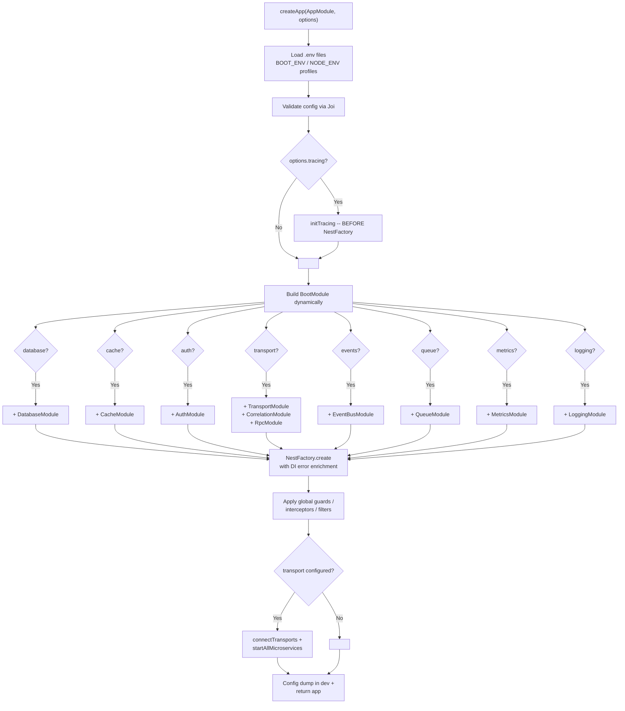

<h1 align="center">nestjs-boot</h1>

<p align="center">
  <strong>Spring Boot-style auto-configuration for NestJS.</strong><br/>
  One config object. Zero wiring. Production-ready.
</p>

<p align="center">
  <a href="https://www.npmjs.com/package/nestjs-boot"></a>
  <a href="https://www.npmjs.com/package/nestjs-boot"></a>
  <a href="https://github.com/nthanhdo/nestjs-boot/actions"></a>
  <a href="https://opensource.org/licenses/MIT"></a>
  <a href="#modules"></a>
  <a href="https://github.com/nthanhdo/nestjs-boot"></a>
</p>

<p align="center">
  <a href="#quick-start">Quick Start</a> &bull;
  <a href="#why-nestjs-boot">Why?</a> &bull;
  <a href="#modules">Modules</a> &bull;
  <a href="#full-config-reference">Config</a> &bull;
  <a href="#documentation">Docs</a> &bull;
  <a href="#contributing">Contributing</a>
</p>

<p align="center">
  <a href="README.vi.md">Tieng Viet</a>
</p>

---

## Why nestjs-boot?

Building a production NestJS service means wiring up databases, cache, auth, health checks, metrics, tracing, transports, queues, and more -- over and over. `nestjs-boot` eliminates that boilerplate.

| | Without nestjs-boot | With nestjs-boot |
|---|---|---|
| **Setup** | ~40 lines of infrastructure imports per service | 1 config object in `main.ts` |
| **Modules** | Wire each one manually | Auto-loaded based on config |
| **Multi-DB** | DIY connection management | Built-in reader/writer split |
| **Auth** | Build JWT + RBAC + policies from scratch | Declare in config, use decorators |
| **Observability** | Integrate 3-5 libraries | `metrics`, `logging`, `tracing` keys |

`nestjs-boot` is a **runtime package** -- not a template or boilerplate. Install it, configure it, and your `AppModule` stays clean with only business logic.

```bash
npm install nestjs-boot
```

## Quick Start

### Option 1: Create a new project (interactive CLI)

```bash
npx nestjs-boot new my-service
cd my-service
npm install
npm run start:dev
```

The CLI prompts for database (MongoDB, PostgreSQL, or None), cache (Redis, Memcached), auth (JWT), and transport (HTTP, gRPC, TCP, NATS, RabbitMQ). Or pass flags:

```bash
npx nestjs-boot new my-service --db=mongodb --cache=redis --auth=jwt --transport=grpc
npx nestjs-boot new my-service --db=postgres --auth=jwt    # PostgreSQL + Prisma
npx nestjs-boot new my-service -y  # defaults: MongoDB + Redis + JWT + HTTP
```

Test it:

```bash
curl http://localhost:3000/health       # health check
curl http://localhost:3000/metrics      # Prometheus metrics
```

### Option 2: Add to an existing project

```ts
// main.ts
import { createApp } from 'nestjs-boot';
import { AppModule } from './app.module';

const app = await createApp(AppModule, {
  database: {
    connections: {
      master: { writerUri: process.env.MONGO_URI!, readerUri: process.env.MONGO_READER_URI },
    },
  },
  cache: { redis: { url: process.env.REDIS_URL! }, defaultTtl: 300 },
  auth: { jwt: { secret: process.env.JWT_SECRET! } },
  health: { enabled: true },
  response: { envelope: true },
});

await app.listen(3000);
```

Every top-level config key is optional -- omit a section and that module is simply not loaded.

### Option 3: Run the 10-service example

```bash
git clone https://github.com/nthanhdo/nestjs-boot.git
cd nestjs-boot/examples/microservices
docker-compose up --build
```

Starts 10 services + MongoDB + Redis communicating via gRPC. See [examples/microservices/](examples/microservices/).

---

## Architecture


### Boot Sequence



---

## Modules

### Database

**Multi-driver:** MongoDB (Mongoose) and PostgreSQL (Prisma) -- use one or both in the same project.

**Shared interface:** `IRepository<T>` defines the common CRUD contract implemented by both `BaseRepository<T>` (Mongoose) and `PrismaBaseRepository<T>` (Prisma). Swap database drivers without changing service code.

<details>
<summary><strong>MongoDB</strong></summary>

Multi-connection with automatic reader/writer split. `BaseRepository<T>` provides CRUD + pagination with automatic connection routing. `CachedBaseRepository<T>` (alias `CachedRepository<T>`) adds cache-aside on top with automatic invalidation. `CrudService<T>` provides lifecycle hooks (`beforeCreate`, `afterCreate`, etc.). `UnitOfWork` supports MongoDB transactions. `Specification<T>` enables composable query filters. **Migrations:** `MigrationRunner` with `_migrations` collection tracking state.

```ts
database: {
  connections: {
    master: { writerUri: 'mongodb://primary:27017/app', readerUri: 'mongodb://replica:27017/app' },
  },
}
```

CLI: `npx nestjs-boot migrate`, `migrate:create`, `migrate:rollback`, `migrate:status`.

</details>

<details>
<summary><strong>PostgreSQL (Prisma)</strong></summary>

`PrismaModule.register()` with lazy `@prisma/client` loading. `PrismaBaseRepository<T>` provides CRUD, pagination, upsert, and transactions. `PrismaCrudService<T>` provides the same lifecycle-hook pattern as `CrudService<T>` but backed by Prisma. `PrismaService` manages lifecycle (`$connect` / `$disconnect`) and exposes `$transaction()`.

```ts
PrismaModule.register({ url: process.env.DATABASE_URL })
```

Uses standard `npx prisma migrate` workflow.

</details>

### Cache

L1 in-memory LRU + optional L2 Redis. Size-aware routing (>1MB goes to L2 only). Optional Memcached adapter for L1. `MultiCacheService` provides `getOrSet()`, `del()`, `delByPrefix()`.

**Advanced:** `CacheStampedeGuard` (prevents thundering herd), `CacheWarmer` (pre-warms at startup), `TaggedCacheService` (invalidate by tag), `CacheStats` (hit rate statistics).

```ts
cache: { redis: { url: 'redis://localhost:6379' }, defaultTtl: 300 }
```

### Auth

Full auth stack: JWT (access + refresh + token family tracking + reuse detection), API key validation, RBAC with role hierarchy + DB-backed permissions + privilege boundary, `@Public()` bypass, `@CurrentUser()` extraction.

<details>
<summary><strong>RBAC, Scope, Policy, Audit, Break Glass, Social, TOTP, Session</strong></summary>

**RBAC:** `@Roles()`, `@Permissions()`, `@RequireScope()`, `@CheckPolicy()`. Role hierarchy with inheritance. Wildcard permissions (`user.*`, `*`) with glob matching. `PrivilegeBoundary` prevents privilege escalation. `RoleManager` for role/permission CRUD + idempotent seeding. `denyByDefault` mode for zero-trust.

**Break Glass:** `BreakGlassModule` for emergency access override. `@BreakGlass()` decorator marks endpoints that can bypass normal auth in declared emergencies. Audit-logged with automatic expiry.

**Scope:** `ScopeModule` with `OWN -> TEAM -> DEPARTMENT -> ORGANIZATION -> SYSTEM` access levels. `ScopeResolver` builds query filters per scope.

**Policy:** `PolicyModule` with named `AuthorizationPolicy` implementations, `PolicyEngine`, structured `AuthorizationResult` (allowed/reason/scope/policy).

**Organizations:** `OrganizationModule` for generic org/department/team hierarchy with membership management.

**Audit:** `AuditModule` for structured audit logging + `SecurityEventType` tracking. Auto-logs auth denials via `AuditInterceptor`.

**Security:** `LoginTracker` with configurable lockout (max attempts + duration). `TokenStore` for refresh token family tracking + reuse detection.

**Social/OAuth2:** `SocialAuthModule` with `GoogleStrategy` and `GitHubStrategy`.
**TOTP:** `TotpService` for 2FA. **Session:** `SessionAuthModule` with pluggable `SessionStore`.
**WebSocket:** `WsJwtGuard` for authenticated WebSocket connections.

</details>

```ts
auth: {
  jwt: { secret: '...', refreshSecret: '...', refreshExpiresIn: '7d' },
  rbac: {
    enabled: true,
    denyByDefault: true,
    hierarchy: [
      { name: 'SUPER_ADMIN', inherits: ['ADMIN'], permissions: ['*'] },
      { name: 'ADMIN', inherits: ['MANAGER'], permissions: ['user.delete'] },
      { name: 'MANAGER', inherits: ['STAFF'], permissions: ['user.create'] },
      { name: 'STAFF', permissions: ['task.read', 'task.complete'] },
    ],
  },
}
```

### Transport

Config-driven hybrid HTTP + gRPC/TCP/NATS/RabbitMQ. `ServiceClient<T>` provides type-safe RPC calls with auto correlation-ID forwarding. `createResilientClient()` wraps clients with circuit breaker + retry.

```ts
transport: {
  grpc: { url: '0.0.0.0:5000', package: 'product', protoPath: 'product.proto' },
}
```

### Observability

| Feature | Module | Key highlight |
|---|---|---|
| **Metrics** | `MetricsModule` | Prometheus endpoint, HTTP/DB/Cache/Queue collectors |
| **Logging** | `LoggingModule` | Structured pino, request timing, field redaction |
| **Tracing** | `TracingModule` | OpenTelemetry, `@BootTrace()` decorator, auto-spans |
| **Correlation** | `CorrelationModule` | `X-Correlation-Id` propagated via `AsyncLocalStorage` |

```ts
metrics: { enabled: true, path: '/metrics', prefix: 'myapp_' },
logging: { level: 'info', pretty: true, redact: ['req.headers.authorization'] },
tracing: { exporter: 'otlp', endpoint: 'http://jaeger:4318', sampleRate: 0.1 },
```

### Resilience

`@CircuitBreaker()` with closed/open/half-open state machine. `@Retry({ attempts: 3, backoff: 'exponential' })`. `@Timeout(5000)` per-method deadlines.

```ts
resilience: { circuitBreaker: { failureThreshold: 5, resetTimeout: 30000 } }
```

### More Modules

<details>
<summary><strong>Queue & Events</strong></summary>

**Queue:** BullMQ job processing with `@Processor`, `@Process`, `@OnFailed`, `@OnCompleted` decorators.

**Events:** In-process or Redis pub/sub event bus. `BootEvent` for fire-and-forget. `BootQuery` for request/response.

```ts
queue: { driver: 'bullmq', redis: { url: 'redis://localhost:6379' } },
events: { transport: 'redis', redis: { url: 'redis://localhost:6379' } },
```

</details>

<details>
<summary><strong>CQRS & Event Sourcing</strong></summary>

CommandBus, AggregateRoot (DDD), EventStore (MongoDB + memory), Projections via `@OnDomainEvent`, Outbox pattern (at-least-once delivery), Saga with compensations.

```ts
cqrs: { eventStore: 'mongodb', outbox: { enabled: true } }
```

</details>

<details>
<summary><strong>Multi-tenancy</strong></summary>

3 isolation strategies: row-level, schema-level, database-level. `TenantAwareRepository` auto-scopes queries. `@CurrentTenant()` decorator.

```ts
tenancy: { strategy: 'header', isolation: 'row' }
```

</details>

<details>
<summary><strong>Payments & Webhooks</strong></summary>

Stripe/PayPal signature verification (HMAC-SHA256). `IdempotencyGuard` prevents duplicate processing.

```ts
webhooks: { providers: { stripe: { secret: process.env.STRIPE_WEBHOOK_SECRET! } } }
```

</details>

<details>
<summary><strong>File Storage</strong></summary>

Driver abstraction: `local` | `s3` | `gcs`. `FileValidationPipe` checks mime + size. `getSignedUrl()` for temporary URLs.

```ts
storage: { driver: 's3', s3: { bucket: 'my-bucket', region: 'us-east-1' } }
```

</details>

<details>
<summary><strong>Alerts & Deploy</strong></summary>

**Alerts:** Multi-channel (Console, Webhook, Slack, Discord, PagerDuty). Rule-based evaluation.

**Deploy:** Lifecycle hooks with `@OnDeploy()`, env validation, dependency checks, readiness gates.

</details>

<details>
<summary><strong>API Versioning, Swagger, WebSocket, Graceful Shutdown</strong></summary>

**Versioning:** URI / header / media-type. `@DeprecatedVersion('2027-01-01')` adds Sunset header.

**Swagger:** Auto-configured from `package.json`. Auth schemes auto-added. Dev-only by default.

**WebSocket:** Redis adapter for multi-instance scaling. `BootWsGateway` base class. Correlation ID support.

**Shutdown:** Drain in-flight requests, close connections, flush queues. K8s-aware with pre-stop delay.

</details>

<details>
<summary><strong>DI Safety & Architecture</strong></summary>

**Error enrichment:** `parseDiError()` turns cryptic Nest DI errors into actionable fix suggestions.

**Contracts:** `createContract<T>()` for interface-based DI. `validateContracts()` catches missing bindings at startup.

**Graph:** `analyzeModules()` + `detectCycles()` (Tarjan's SCC) + `renderMermaid()`.

**Layers:** `@Layer(ModuleLayer.INFRASTRUCTURE)` + `validateLayers()` prevents upward dependencies.

</details>

---

## CLI Commands

```bash
npx nestjs-boot new <name>             # Interactive project scaffolding
npx nestjs-boot new <name> -y          # All defaults (MongoDB + Redis + JWT)
npx nestjs-boot new <name> --db=postgres --auth=jwt

npx nestjs-boot g resource <name>      # Generate CRUD resource (auto-detects Mongoose/Prisma)
npx nestjs-boot g auth                 # Scaffold complete JWT auth flow

npx nestjs-boot graph                  # Module dependency graph (Mermaid)
npx nestjs-boot graph --strict         # Exit 1 if cycles found (CI gate)

npx nestjs-boot migrate                # Run MongoDB migrations
npx nestjs-boot migrate:create <name>  # Create migration file
npx nestjs-boot migrate:status         # Show migration status
```

---

## Full Config Reference

<details>
<summary><strong>Click to expand BootOptions interface</strong></summary>

```ts
interface BootOptions {
  database?: {
    connections: Record<string, {
      writerUri: string;
      readerUri?: string;
      options?: MongooseConnectionOptions;
    }>;
  };
  cache?: {
    redis?: { url: string };
    memcached?: { servers: string };
    defaultTtl?: number;                    // seconds (default: 300)
  };
  response?: {
    envelope?: boolean;                     // wrap in { statusCode, message, data }
    errorHandler?: boolean;                 // global AllExceptionsFilter (default: true)
  };
  health?: {
    enabled?: boolean;                      // default: true
    path?: string;                          // default: '/health'
  };
  auth?: {
    jwt?: {
      secret: string;
      signOptions?: { expiresIn?: string | number; algorithm?: string };
      refreshSecret?: string;
      refreshExpiresIn?: string | number;
    };
    apiKey?: { enabled: boolean; validate: (key: string) => Promise<boolean> };
    rbac?: { enabled: boolean };
  };
  transport?: {
    grpc?: { url: string; package: string | string[]; protoPath: string | string[] };
    tcp?: { host?: string; port?: number };
    nats?: { url: string; queue?: string };
    rabbitmq?: { urls: string[]; queue: string };
    clients?: Record<string, { transport: string; options: object }>;
  };
  events?: { transport: 'memory' | 'redis'; redis?: { url: string } };
  queue?: {
    driver: 'bullmq';
    redis: { url: string };
    defaultOptions?: { attempts?: number; backoff?: { type: string; delay: number } };
  };
  correlation?: { header?: string; generator?: () => string };
  metrics?: { enabled?: boolean; path?: string; prefix?: string; defaultMetrics?: boolean };
  logging?: { level?: string; pretty?: boolean; redact?: string[] };
  tracing?: { exporter: 'otlp' | 'jaeger' | 'zipkin' | 'console'; endpoint?: string; sampleRate?: number };
  resilience?: {
    circuitBreaker?: { failureThreshold?: number; resetTimeout?: number };
    timeout?: { default?: number };
  };
  shutdown?: { timeout?: number; signals?: string[] };
  tenancy?: { strategy: 'header' | 'subdomain' | 'path'; isolation: 'database' | 'schema' | 'row' };
  versioning?: { type: 'uri' | 'header' | 'media-type'; defaultVersion?: string };
  swagger?: { enabled?: boolean; path?: string; title?: string };
  websocket?: { adapter?: 'socket.io' | 'ws'; redis?: { url: string } };
  webhooks?: { providers: Record<string, { secret: string }> };
  storage?: { driver: 'local' | 's3' | 'gcs'; local?: { root: string }; s3?: { bucket: string; region: string }; gcs?: { bucket: string; projectId: string } };
  cqrs?: { eventStore: 'mongodb' | 'memory'; outbox?: { enabled: boolean } };
  layers?: { enabled?: boolean; strict?: boolean };
  lazy?: boolean;                            // defer connections until first request (serverless)
}
```

</details>

---

## Standalone Usage

Use any module independently without `createApp()`:

```ts
import { DatabaseModule, CacheModule, AuthModule } from 'nestjs-boot';

@Module({
  imports: [
    DatabaseModule.register({ connections: { master: { writerUri: '...' } } }),
    CacheModule.register({ redis: { url: '...' }, defaultTtl: 600 }),
    AuthModule.register({ jwt: { secret: '...' }, rbac: { enabled: true } }),
  ],
})
export class AppModule {}
```

## Plugin System

Extend nestjs-boot without modifying core:

```ts
import { BootPlugin } from 'nestjs-boot';

const myPlugin: BootPlugin = {
  name: 'my-plugin',
  configKey: 'myPlugin',
  register: (options) => MyModule.register(options),
  applyGlobals: (app) => app.useGlobalInterceptors(new MyInterceptor()),
};

const app = await createApp(AppModule, config, { plugins: [myPlugin] });
```

## Testing

Built-in test utilities for every layer:

```ts
const suite = createTestSuite({ imports: [AppModule] });
const app = await suite.compile();
const client = createTestClient(app);

await client.get('/products').expect(200);
await suite.teardown();
```

Includes: `createFactory()` (data factories with traits), `createGrpcTestClient()`, `ContractVerifier`, `createTestJwt()`, `MockAuthModule`, `seedDatabase()` / `cleanDatabase()`.

---

## Tools & Examples

| Tool | Description |
|---|---|
| [10-service microservices](examples/microservices/) | API Gateway + 9 services, gRPC, EventBus, BullMQ |
| [Learning skeleton](examples/learning/) | Minimal starter for understanding nestjs-boot |
| [Web Generator](packages/web-generator/) | Browser-based project generator with visual config builder |
| [Admin Dashboard](packages/admin-dashboard/) | GUI for project generation, module exploration, architecture diagrams |
| [Visualize Flow](packages/visualize-flow/) | Animated flow diagrams for all subsystems |

## Optional Peer Dependencies

Install only what you use:

```bash
npm install mongoose @nestjs/mongoose        # MongoDB
npm install @prisma/client && npx prisma init # PostgreSQL
npm install ioredis                          # Redis cache
npm install bullmq                           # Queue
npm install pino pino-pretty                 # Logging
npm install prom-client                      # Metrics
npm install @nestjs/terminus                 # Health checks
npm install @opentelemetry/sdk-node          # Tracing
npm install @grpc/grpc-js @grpc/proto-loader # gRPC transport
npm install @nestjs/microservices            # Transport module
```

## Documentation

| Guide | Topic |
|---|---|
| [Getting Started](docs/guides/en/getting-started.md) | Installation, minimal example, progressive config |
| [Prisma (PostgreSQL)](docs/guides/en/prisma.md) | PrismaModule, PrismaCrudService, migrations |
| [Authorization](docs/guides/en/authorization.md) | RBAC, policies, wildcard permissions |
| [Scope Authorization](docs/guides/en/scope-authorization.md) | OWN/TEAM/DEPT/ORG/SYSTEM access levels |
| [Testing Guide](docs/guides/en/testing-guide.md) | Factories, suites, snapshots, gRPC testing |
| [Transport Selection](docs/guides/en/transport-selection.md) | gRPC vs TCP vs NATS vs RabbitMQ |
| [Production Checklist](docs/guides/en/production-checklist.md) | Health, shutdown, metrics, tracing, security |
| [DI Best Practices](docs/guides/en/di-best-practices.md) | Contract-based DI, layer enforcement, graph analysis |
| [User Management](docs/guides/en/user-management.md) | User lifecycle, roles, organizations |
| [When to Use](docs/guides/en/when-to-use.md) | Decision guide for adopting nestjs-boot |

## Roadmap

- [ ] TypeORM database adapter
- [ ] Rate limiting module
- [ ] WebSocket transport improvements
- [ ] Docs website

## Contributing

Contributions are welcome! See [CONTRIBUTING.md](CONTRIBUTING.md) for the full guide.

```bash
git clone https://github.com/nthanhdo/nestjs-boot.git
cd nestjs-boot
npm install
npm test          # 900+ tests
npm run build     # CJS + ESM + DTS
```

---

## Author

<table>
  <tr>
    <td align="center">
      <a href="https://github.com/nthanhdo">
        
        <br />
        <strong>Do Nguyen</strong>
      </a>
      <br />
      Tech Lead | NestJS &middot; Laravel &middot; AWS | 12+ yrs
      <br />
      Ho Chi Minh City, Vietnam
      <br /><br />
      <a href="https://github.com/nthanhdo"></a>
      <a href="https://www.linkedin.com/in/do-nguyen-a7815d61/"></a>
    </td>
  </tr>
</table>

## License

[MIT](LICENSE) -- Made with dedication in Vietnam.
