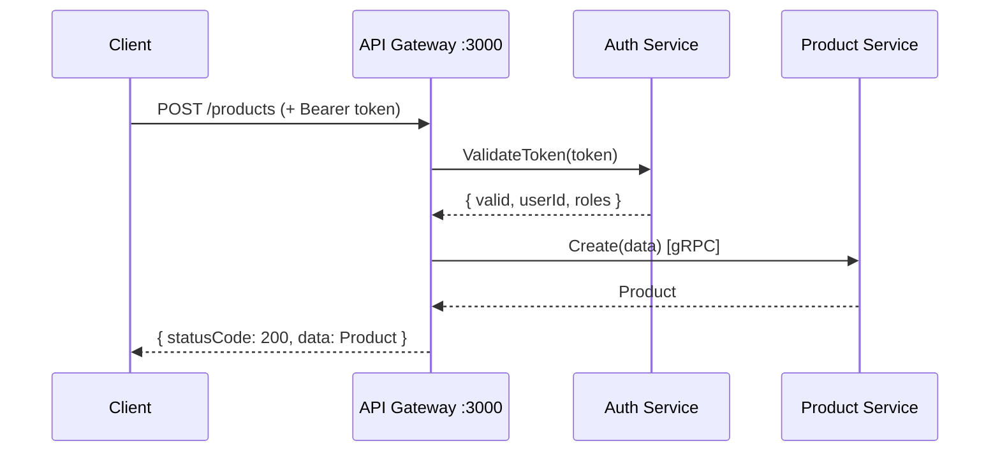
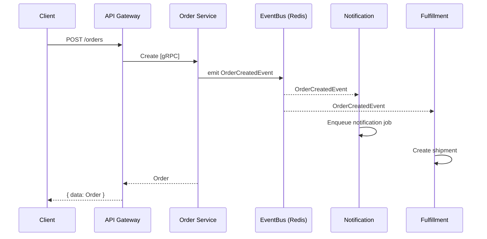
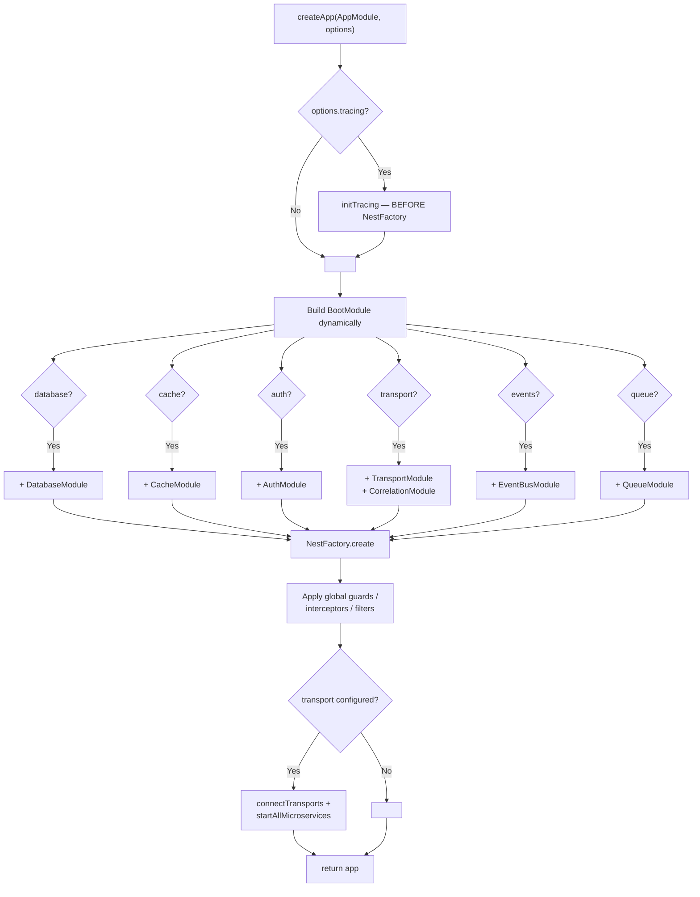

# nestjs-boot

> Production-ready NestJS microservice framework. One config, zero wiring.

[](https://www.npmjs.com/package/nestjs-boot)
[](https://opensource.org/licenses/MIT)
[](https://github.com/nthanhdo/nestjs-boot/actions/workflows/ci.yml)

`nestjs-boot` is a runtime package (not a template). You call `createApp(AppModule, config)` and it auto-wires databases, cache, auth, gRPC transports, queues, events, health checks, metrics, tracing, and more — based on what you configure.

## Getting Started

### Option 1: Create a new project

```bash
npx nestjs-boot new my-service
cd my-service
npm install
npm run start:dev
```

### Option 2: Clone and run the example (10-service microservice architecture)

```bash
git clone https://github.com/nthanhdo/nestjs-boot.git
cd nestjs-boot/examples/microservices
docker-compose up --build
```

This starts 10 services + MongoDB + Redis:

| Service | HTTP | gRPC | What it demonstrates |
|---------|------|------|---------------------|
| API Gateway | [:3000](http://localhost:3000) | — | JWT auth, correlation ID, response envelope, 9 gRPC clients |
| Auth Service | :3003 | :5001 | `BootJwtService`, bcrypt, user management |
| Product Service | :3002 | :5002 | L1+L2 cache, reader/writer split |
| Order Service | :3001 | :5003 | Database, gRPC server |
| Notification Service | :3004 | :5004 | EventBus (`@OnEvent`), BullMQ queue (`@Processor`) |
| File Service | :3005 | :5005 | File upload, disk storage, metadata in MongoDB |
| Scheduler Service | :3006 | :5006 | Cron-like jobs via BullMQ repeatable queues |
| Blog Service | :3007 | :5007 | Article CRUD with Redis-cached reads |
| Fulfillment Service | :3008 | :5008 | EventBus + Queue pipeline, order fulfillment |
| Campaign Service | :3009 | :5009 | Promo campaigns, EventBus lifecycle |
| MongoDB | :27017 | — | |
| Redis | :6379 | — | |

### Try it

```bash
# Register
curl -s -X POST http://localhost:3000/auth/register \
  -H 'Content-Type: application/json' \
  -d '{"email":"test@test.com","password":"123456","name":"Test User"}'

# Login (save the accessToken)
TOKEN=$(curl -s -X POST http://localhost:3000/auth/login \
  -H 'Content-Type: application/json' \
  -d '{"email":"test@test.com","password":"123456"}' | jq -r '.data.accessToken')

# Create a product
curl -s -X POST http://localhost:3000/products \
  -H 'Content-Type: application/json' \
  -H "Authorization: Bearer $TOKEN" \
  -d '{"name":"Wireless Mouse","price":29.99,"category":"electronics","stock":150}'

# Create a blog article
curl -s -X POST http://localhost:3000/blog/articles \
  -H 'Content-Type: application/json' \
  -H "Authorization: Bearer $TOKEN" \
  -d '{"title":"Hello World","content":"First post!","tags":["intro"],"authorId":"user-123"}'

# Create a campaign
curl -s -X POST http://localhost:3000/campaigns \
  -H 'Content-Type: application/json' \
  -H "Authorization: Bearer $TOKEN" \
  -d '{"name":"Summer Sale","promoCode":"SUMMER20","discountPercent":20,"startDate":"2026-08-01T00:00:00Z","endDate":"2026-08-31T23:59:59Z"}'

# Create an order (triggers Fulfillment + Notification)
curl -s -X POST http://localhost:3000/orders \
  -H 'Content-Type: application/json' \
  -H "Authorization: Bearer $TOKEN" \
  -d '{"userId":"user-123","items":[{"productId":"<id>","quantity":2,"price":29.99}],"promoCode":"SUMMER20"}'

# Schedule a job
curl -s -X POST http://localhost:3000/scheduler/jobs \
  -H 'Content-Type: application/json' \
  -H "Authorization: Bearer $TOKEN" \
  -d '{"name":"daily-report","cron":"0 9 * * *","handler":"generateDailyReport"}'

# Health check
curl -s http://localhost:3000/health | jq
```

## Architecture


All 10 services communicate via **gRPC**. Each uses `createApp()` with different feature combinations. Infrastructure (MongoDB + Redis) is shared.

See [`examples/microservices/`](examples/microservices/) for per-service details, gRPC method tables, and API routes.

### Request Flow



### Event Flow



## How `createApp()` Works



**Before** — manual wiring (~40 lines of infrastructure per service):

```ts
@Module({
  imports: [
    MongooseModule.forRootAsync({ connectionName: 'master_writer', useFactory: () => ({ uri: '...' }) }),
    MongooseModule.forRootAsync({ connectionName: 'master_reader', useFactory: () => ({ uri: '...' }) }),
    CacheModule.register({ store: redisStore, url: '...' }),
    ConfigModule.forRoot({ validationSchema: Joi.object({ /* ... */ }) }),
    TerminusModule.forRoot(),
    // + interceptors, filters, health indicators ...
  ],
})
export class AppModule {}
```

**After** — one config object in `main.ts`:

```ts
import { createApp } from 'nestjs-boot';
import { AppModule } from './app.module';

const app = await createApp(AppModule, {
  database: {
    connections: {
      master: { writerUri: process.env.MONGO_URI!, readerUri: process.env.MONGO_READER_URI },
    },
  },
  cache: { redis: { url: process.env.REDIS_URL! }, defaultTtl: 300 },
  health: { enabled: true },
  response: { envelope: true },
});

await app.listen(3000);
```

`createApp()` validates config via Joi, creates only the modules you configure, applies global interceptors/filters, connects microservice transports, and enables shutdown hooks. Your `AppModule` stays clean — just business logic.

## Modules

### Database

Multi-connection MongoDB with automatic reader/writer split.

```ts
database: {
  connections: {
    master: { writerUri: 'mongodb://primary:27017/app', readerUri: 'mongodb://replica:27017/app' },
    analytics: { writerUri: 'mongodb://analytics:27017/metrics' },
  },
}
```

Register schemas with `DatabaseModule.forFeature('master', [{ name: 'Product', schema: ProductSchema }])`. Use `BaseRepository<T>` for CRUD with automatic reader/writer routing, or `CachedBaseRepository<T>` for cache-aside on top.

### Cache

L1 in-memory LRU + optional L2 Redis. Size-aware routing (>1MB goes to L2 only).

```ts
cache: { redis: { url: 'redis://localhost:6379' }, defaultTtl: 300 }
```

Inject with `@InjectCache()` and use `getOrSet(key, factory, { ttl, l2Ttl })`.

### Auth

JWT signing/verification with access + refresh tokens, API key validation, RBAC guards.

```ts
auth: {
  jwt: { secret: '...', signOptions: { expiresIn: '15m' }, refreshSecret: '...', refreshExpiresIn: '7d' },
  rbac: { enabled: true },
}
```

Use `BootJwtService` for `sign()`, `verify()`, `signRefresh()`, `verifyRefresh()`. Guards: `JwtAuthGuard`, `RolesGuard`, `@Roles('admin')`, `@Public()`.

### gRPC Transport

Config-driven gRPC server and client connections.

```ts
// Server
transport: { grpc: { url: '0.0.0.0:5000', package: 'product', protoPath: 'product.proto' } }

// Clients (in gateway)
transport: { clients: { PRODUCT_SERVICE: { transport: 'grpc', options: { url: 'product:5000', ... } } } }
```

### EventBus

In-process or Redis pub/sub event system with typed events.

```ts
events: { transport: 'redis', redis: { url: 'redis://localhost:6379' } }
```

Extend `BootEvent`, emit via `EventBusService.emit(event)`, subscribe with `@OnEvent(MyEvent)`.

### Queue

BullMQ job queue with decorator-driven processors.

```ts
queue: { driver: 'bullmq', redis: { url: 'redis://localhost:6379' } }
```

`QueueService.addJob(queue, name, data)` to enqueue. `@Processor('queue')` + `@Process('job')` to handle. `@OnFailed()`, `@OnCompleted()` for lifecycle hooks.

### Health

Auto-detects configured drivers (MongoDB, Redis) and registers health indicators.

```ts
health: { enabled: true, path: '/health' }
```

### Response Envelope

Wraps responses in `{ statusCode, message, data }`. Detects paginated results. Global exception filter included.

```ts
response: { envelope: true, errorHandler: true }
```

### Correlation ID

Propagates `X-Correlation-Id` across services via middleware + AsyncLocalStorage.

```ts
correlation: { header: 'X-Correlation-Id' }
```

### Metrics

Prometheus endpoint with HTTP request tracking. Config: `metrics: { path: '/metrics', prefix: 'myapp_' }`.

### Logging

Structured pino logging with request timing. Config: `logging: { level: 'info', pretty: true }`.

### Tracing

OpenTelemetry distributed tracing. Config: `tracing: { exporter: 'otlp', endpoint: '...', sampleRate: 0.1 }`.

### Resilience

`@CircuitBreaker()`, `@Retry()`, `@Timeout()` decorators. Config: `resilience: { timeout: { default: 5000 } }`.

## Full Config Reference

```ts
interface BootOptions {
  database?: {
    connections: Record<string, {
      writerUri: string;
      readerUri?: string;
      options?: MongooseConnectionOptions;
    }>;
  };
  cache?: {
    redis?: { url: string };
    defaultTtl?: number;           // seconds (default: 300)
  };
  response?: {
    envelope?: boolean;            // default: false
    errorHandler?: boolean;        // default: true
  };
  health?: {
    enabled?: boolean;             // default: true
    path?: string;                 // default: '/health'
  };
  auth?: {
    jwt?: {
      secret: string;
      signOptions?: { expiresIn?: string | number; algorithm?: string };
      refreshSecret?: string;
      refreshExpiresIn?: string | number;
    };
    apiKey?: { enabled: boolean; validate: (key: string) => Promise<boolean> };
    rbac?: { enabled: boolean };
  };
  transport?: {
    grpc?: { url: string; package: string | string[]; protoPath: string | string[] };
    tcp?: { host?: string; port?: number };
    nats?: { url: string; queue?: string };
    rabbitmq?: { urls: string[]; queue: string };
    clients?: Record<string, { transport: string; options: object }>;
  };
  events?: {
    transport: 'memory' | 'redis';
    redis?: { url: string };
  };
  queue?: {
    driver: 'bullmq';
    redis: { url: string };
    defaultOptions?: {
      attempts?: number;
      backoff?: { type: 'exponential' | 'fixed'; delay: number };
      removeOnComplete?: boolean | number;
      removeOnFail?: boolean | number;
    };
  };
  correlation?: { header?: string; generator?: () => string };
  metrics?: { enabled?: boolean; path?: string; prefix?: string; defaultMetrics?: boolean };
  logging?: { level?: string; pretty?: boolean; redact?: string[] };
  tracing?: { exporter: 'otlp' | 'jaeger' | 'zipkin' | 'console'; endpoint?: string; sampleRate?: number };
  resilience?: {
    circuitBreaker?: { failureThreshold?: number; resetTimeout?: number };
    timeout?: { default?: number };
  };
  shutdown?: { timeout?: number; signals?: string[] };
  interServiceAuth?: { propagation?: boolean; serviceToken?: string };
}
```

Every top-level section is optional. Omitted sections = that module is not loaded.

## Standalone Usage

Use any module without `createApp()`:

```ts
import { DatabaseModule, CacheModule } from 'nestjs-boot';

@Module({
  imports: [
    DatabaseModule.register({ connections: { master: { writerUri: '...' } } }),
    CacheModule.register({ redis: { url: '...' }, defaultTtl: 600 }),
  ],
})
export class AppModule {}
```

## CLI

```bash
npx nestjs-boot new my-service          # Scaffold a new project
npx nestjs-boot new my-service --grpc   # With gRPC transport
```

## Optional Peer Dependencies

Install only what you use:

```bash
npm install ioredis           # Redis L2 cache
npm install bullmq            # Queue module
npm install pino pino-pretty  # Logging module
npm install prom-client       # Metrics module
npm install @nestjs/terminus  # Health checks
npm install @opentelemetry/sdk-node  # Tracing
```

## Contributing

```bash
git clone https://github.com/nthanhdo/nestjs-boot.git
cd nestjs-boot
npm install
npm test
```

## License

[MIT](LICENSE)
