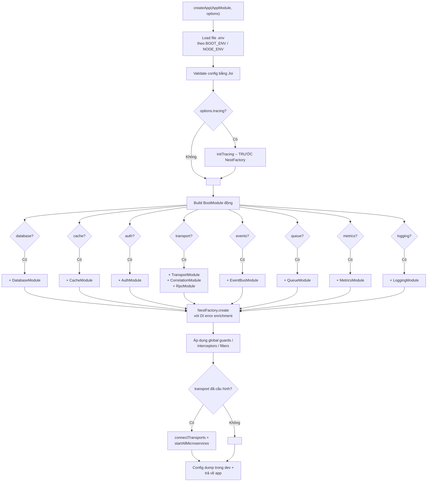

# nestjs-boot

> Framework microservice NestJS sẵn sàng cho production. Một config object, zero wiring.

[](https://www.npmjs.com/package/nestjs-boot)
[](https://opensource.org/licenses/MIT)
[](#)
[](#modules)

> [English version](README.md)

## nestjs-boot là gì?

`nestjs-boot` là một **runtime package** (không phải template hay boilerplate). Bạn cài nó như dependency, gọi `createApp(AppModule, config)`, và nó tự động wire database, cache, auth, transport, queue, event, health check, metrics, tracing, và nhiều thứ khác — dựa trên những gì bạn cấu hình. Mọi module đều optional: bỏ qua phần config = module đó không được load. `AppModule` của bạn chỉ có business logic.

## Bắt Đầu Nhanh

### Cách 1: Tạo project mới (CLI tương tác)

```bash
npx nestjs-boot new my-service
cd my-service
npm install
npm run start:dev
```

CLI sẽ hỏi bạn chọn database (MongoDB, PostgreSQL, MySQL, DynamoDB, Elasticsearch), cache (Redis, Memcached), auth (JWT), và transport (HTTP, gRPC, TCP, NATS, RabbitMQ). Hoặc truyền flags trực tiếp:

```bash
npx nestjs-boot new my-service --db=postgres --cache=redis --auth=jwt --transport=grpc
npx nestjs-boot new my-service -y  # mặc định: MongoDB + Redis + JWT + HTTP
```

Thử nghiệm:

```bash
curl http://localhost:3000/health       # kiểm tra sức khỏe
curl http://localhost:3000/metrics      # Prometheus metrics
```

### Cách 2: Chạy ví dụ 10 services

```bash
git clone https://github.com/nthanhdo/nestjs-boot.git
cd nestjs-boot/examples/microservices
docker-compose up --build
```

Khởi động 10 services + MongoDB + Redis giao tiếp qua gRPC. Xem chi tiết tại [examples/microservices/](examples/microservices/).

## Kiến Trúc


## `createApp()` -- Cách Hoạt Động

**Trước** -- wire thủ công (~40 dòng infrastructure mỗi service):

```ts
@Module({
  imports: [
    MongooseModule.forRootAsync({ connectionName: 'master_writer', useFactory: () => ({ uri: '...' }) }),
    MongooseModule.forRootAsync({ connectionName: 'master_reader', useFactory: () => ({ uri: '...' }) }),
    CacheModule.register({ store: redisStore, url: '...' }),
    ConfigModule.forRoot({ validationSchema: Joi.object({ /* ... */ }) }),
    TerminusModule.forRoot(),
    // + interceptors, filters, health indicators ...
  ],
})
export class AppModule {}
```

**Sau** -- một config object trong `main.ts`:

```ts
import { createApp } from 'nestjs-boot';
import { AppModule } from './app.module';

const app = await createApp(AppModule, {
  database: {
    connections: {
      master: { writerUri: process.env.MONGO_URI!, readerUri: process.env.MONGO_READER_URI },
    },
  },
  cache: { redis: { url: process.env.REDIS_URL! }, defaultTtl: 300 },
  auth: { jwt: { secret: process.env.JWT_SECRET! } },
  health: { enabled: true },
  response: { envelope: true },
});

await app.listen(3000);
```

### Trình Tự Khởi Động



## Các Module

### Database

Kết nối nhiều MongoDB với tự động chia đọc/ghi (reader/writer split). `BaseRepository<T>` cung cấp CRUD + phân trang với tự động định tuyến kết nối. `CachedBaseRepository<T>` thêm cache-aside. `CrudService<T>` có lifecycle hooks (`beforeCreate`, `afterCreate`, v.v.). `UnitOfWork` hỗ trợ MongoDB transactions. `Specification<T>` cho composable query filters.

```ts
database: {
  connections: {
    master: { writerUri: 'mongodb://primary:27017/app', readerUri: 'mongodb://replica:27017/app' },
    analytics: { writerUri: 'mongodb://analytics:27017/metrics' },
  },
}
```

**Migration:** `MigrationRunner` với `_migrations` collection theo dõi trạng thái. CLI: `npx nestjs-boot migrate`, `migrate:create`, `migrate:rollback`, `migrate:status`.

### Cache

L1 in-memory LRU + L2 Redis (tùy chọn). Định tuyến theo kích thước (>1MB chỉ lưu L2). Hỗ trợ Memcached cho L1. `MultiCacheService` cung cấp `getOrSet()`, `del()`, `delByPrefix()`.

**Nâng cao:** `CacheStampedeGuard` (chống thundering herd — chỉ 1 request gọi DB khi cache hết hạn), `CacheWarmer` (làm nóng cache khi khởi động), `TaggedCacheService` (vô hiệu theo tag), `CacheStats` (thống kê hit rate).

```ts
cache: { redis: { url: 'redis://localhost:6379' }, defaultTtl: 300 }
```

### Auth

Bộ xác thực đầy đủ: JWT (access + refresh + thu hồi token), API key, RBAC (`@Roles`, `@Permissions`), `@Public()`, `@CurrentUser()`.

- **Social/OAuth2:** `SocialAuthModule` với `GoogleStrategy` và `GitHubStrategy`.
- **TOTP:** `TotpService` cho xác thực 2 yếu tố (tạo secret, xác minh token).
- **Session:** `SessionAuthModule` với `SessionStore` có thể thay thế và `@Session()`.
- **WebSocket:** `WsJwtGuard` cho kết nối WebSocket có xác thực.
- **Token lifecycle:** `signPasswordReset()`, `signEmailVerification()`, `rotateRefreshToken()`.

```ts
auth: {
  jwt: { secret: '...', refreshSecret: '...', refreshExpiresIn: '7d' },
  apiKey: { enabled: true, validate: async (key) => isValid(key) },
  rbac: { enabled: true },
}
```

### Transport

Cấu hình hybrid HTTP + gRPC/TCP/NATS/RabbitMQ. `ServiceClient<T>` cung cấp gọi RPC type-safe với tự động chuyển tiếp correlation ID. `createResilientClient()` bọc client với circuit breaker + retry. `ServiceDiscoveryHook` hỗ trợ phân giải service động.

```ts
transport: {
  grpc: { url: '0.0.0.0:5000', package: 'product', protoPath: 'product.proto' },
  clients: {
    PRODUCT_SERVICE: { transport: 'grpc', options: { url: 'product:5000', package: 'product', protoPath: 'product.proto' } },
  },
}
```

### Quan Sát (Observability)

- **Metrics:** Prometheus endpoint qua `MetricsModule`. Tự động đo HTTP, DB, Cache, Queue.
- **Logging:** Pino có cấu trúc qua `LoggingModule`. Tự động gắn correlationId vào mọi log.
- **Tracing:** OpenTelemetry qua `TracingModule`. `@BootTrace('tên')` tự động tạo span. `initTracing()` chạy trước NestFactory.
- **Correlation:** `X-Correlation-Id` lan truyền giữa các service qua `AsyncLocalStorage`.
- **Grafana:** 3 dashboard templates (HTTP overview, service health, microservice overview) + alert rules.

```ts
metrics: { enabled: true, path: '/metrics', prefix: 'myapp_' },
logging: { level: 'info', pretty: true, redact: ['req.headers.authorization'] },
tracing: { exporter: 'otlp', endpoint: 'http://jaeger:4318', sampleRate: 0.1 },
```

### Khả Năng Phục Hồi (Resilience)

`@CircuitBreaker()` bọc method với máy trạng thái đóng/mở/nửa-mở. `@Retry({ attempts: 3, backoff: 'exponential' })` tự động thử lại. `@Timeout(5000)` giới hạn thời gian mỗi method.

### Xử Lý Lỗi

`AllExceptionsFilter` cho lỗi HTTP có cấu trúc. `BootRpcExceptionFilter` cho gRPC với ánh xạ trạng thái HTTP↔gRPC. `BootException` thêm trường `code` + `details` ổn định. `MongooseErrorInterceptor` chuyển đổi lỗi duplicate-key và validation. `toProblemDetails()` xuất theo RFC 9457. `ErrorReporter` tích hợp Sentry/Datadog. `errorBoundary()` bọc gọi async với fallback.

```ts
throw new BootException('Không tìm thấy', { code: ErrorCodes.NOT_FOUND, status: 404 });
```

### Queue & Sự Kiện

- **Queue:** BullMQ với `@Processor`, `@Process`, `@OnFailed`, `@OnCompleted`. `QueueService.addJob()` để thêm vào hàng đợi.
- **Sự kiện:** Event bus trong process hoặc Redis pub/sub. `BootEvent` cho fire-and-forget. `BootQuery` cho request/response (`emitAndWait`).

### CQRS & Event Sourcing

- **CommandBus:** Định tuyến 1:1 command tới handler qua `@CommandHandler`.
- **AggregateRoot:** Pattern DDD với `apply()`, `loadFromHistory()`, quản lý version.
- **EventStore:** MongoDB + memory adapter, interface cho EventStoreDB/Kafka.
- **Projection:** `@OnDomainEvent` xây dựng read model tự động khi stream.
- **Outbox:** Ghi event vào DB cùng transaction, publish bất đồng bộ — đảm bảo at-least-once.
- **Saga:** `defineSaga()` builder với bù trừ ngược (reverse compensations).

### Cấu Hình

Joi validation, `.env` + `.env.{BOOT_ENV}` profiles, `BootConfigService` truy cập kiểu dot-notation. Load bất đồng bộ qua `registerAsync()`. Adapter: `AwsSecretsAdapter`, `VaultAdapter`, `EnvFileAdapter`. `ConfigWatcher` cho dev hot-reload. `generateConfigDocs()` xuất tài liệu config.

### An Toàn DI (Dependency Injection)

- **Làm giàu lỗi:** `parseDiError()` + `formatDiError()` biến lỗi DI khó hiểu thành hướng dẫn sửa cụ thể.
- **Contract:** `createContract<T>()` định nghĩa DI token dựa trên interface. Tránh circular dep.
- **Phân tích đồ thị:** `analyzeModules()` + `detectCycles()` (Tarjan's SCC) + `renderMermaid()`.
- **Lớp module:** `@Layer(ModuleLayer.DOMAIN)` + `validateLayers()` ngăn import ngược.

### Multi-tenancy

3 chiến lược cách ly: row-level (chung collection, filter theo `tenantId`), schema-level (prefix collection), database-level (connection riêng mỗi tenant). `TenantAwareRepository` tự động scope query. `@CurrentTenant()` decorator.

### API Versioning

URI / header / media-type versioning. `@DeprecatedVersion('2027-01-01')` thêm header Sunset.

### Swagger/OpenAPI

Tự động cấu hình từ `package.json`. Thêm auth scheme khi AuthModule được cấu hình. `@ApiPaginated`, `@ApiErrorResponses`, `AutoApiProperties()`.

### WebSocket

Redis adapter cho scaling nhiều instance. `BootWsGateway` base class. `WsCorrelationInterceptor` gắn correlationId mọi message.

### Thanh Toán (Webhooks)

Xác minh signature Stripe/PayPal (HMAC-SHA256). `IdempotencyGuard` ngăn xử lý trùng. Custom provider qua interface.

### Lưu Trữ File

Adapter: local / S3 / GCS. `FileValidationPipe` kiểm tra mime + size trước upload. `getSignedUrl()` cho URL tạm thời.

### Kiểm Thử (Testing)

`createTestSuite()` — quản lý lifecycle đầy đủ. `createFactory<T>()` — factory với traits, sequence, `afterCreate` hook. `createTestClient()` — supertest với typed response. `createGrpcTestClient()` — test gRPC in-process. `createMessageDispatcher()` — test message pattern. `ContractVerifier` — xác minh contract. `expectSnapshot()` — snapshot testing. `createTestJwt()` + `MockAuthModule` — auth test helper.

### Health & Shutdown

Health tự động phát hiện driver (MongoDB, Redis). Trả 503 khi đang shutdown. `ShutdownModule` drain request, đóng kết nối, flush queue. Nhận biết K8s với preStop delay.

## Lệnh CLI

```bash
npx nestjs-boot new <tên>                    # tạo project mới (tương tác)
npx nestjs-boot new <tên> -y                 # mặc định, không hỏi
npx nestjs-boot new <tên> --db=postgres      # chọn database
npx nestjs-boot g resource <tên>             # tạo CRUD resource
npx nestjs-boot g resource <tên> --grpc      # resource với gRPC
npx nestjs-boot graph                        # đồ thị dependency (Mermaid)
npx nestjs-boot graph --strict               # thoát 1 nếu có cycle (CI)
npx nestjs-boot migrate                      # chạy migration
npx nestjs-boot migrate:create <tên>         # tạo migration mới
npx nestjs-boot migrate:rollback             # rollback migration cuối
npx nestjs-boot migrate:status               # trạng thái migration
```

## Cấu Hình Đầy Đủ

```ts
interface BootOptions {
  database?: { connections: Record<string, { writerUri: string; readerUri?: string; options?: object }> };
  cache?: { redis?: { url: string }; memcached?: { servers: string }; defaultTtl?: number };
  auth?: { jwt?: { secret: string; refreshSecret?: string }; apiKey?: { enabled: boolean; validate: Function }; rbac?: { enabled: boolean } };
  transport?: { grpc?: object; tcp?: object; nats?: object; rabbitmq?: object; clients?: Record<string, object> };
  events?: { transport: 'memory' | 'redis'; redis?: { url: string } };
  queue?: { driver: 'bullmq'; redis: { url: string } };
  cqrs?: { eventStore: 'mongodb' | 'memory'; snapshotStore?: string; outbox?: { enabled: boolean } };
  metrics?: { enabled?: boolean; path?: string; prefix?: string };
  logging?: { level?: string; pretty?: boolean; redact?: string[] };
  tracing?: { exporter: string; endpoint?: string; sampleRate?: number };
  correlation?: { header?: string };
  resilience?: { circuitBreaker?: object; timeout?: { default?: number } };
  health?: { enabled?: boolean; path?: string };
  shutdown?: { timeout?: number; signals?: string[] };
  response?: { envelope?: boolean; errorHandler?: boolean };
  interServiceAuth?: { propagation?: boolean; serviceToken?: string };
  monitoring?: { errorReporter?: Function };
  versioning?: { type: 'uri' | 'header' | 'media-type'; defaultVersion?: string };
  tenancy?: { strategy: 'header' | 'subdomain' | 'path'; isolation: 'database' | 'schema' | 'row' };
  swagger?: { enabled?: boolean; path?: string; title?: string };
  websocket?: { adapter?: string; redis?: { url: string } };
  storage?: { driver: 'local' | 's3' | 'gcs'; local?: object; s3?: object; gcs?: object };
  webhooks?: { providers: object };
  layers?: { enabled?: boolean; strict?: boolean };
  lazy?: boolean;
}
```

Mọi phần đều optional. Bỏ qua = module không được load.

## Hướng Dẫn

- [Ngăn Chặn Circular Dependency](docs/guides/circular-dependency-prevention.md)
- [Thực Hành Tốt DI](docs/guides/di-best-practices.md)
- [Hướng Dẫn Kiểm Thử](docs/guides/testing-guide.md)
- [Chọn Transport](docs/guides/transport-selection.md)
- [Auth & Rate Limiting](docs/guides/auth-rate-limiting.md)
- [Checklist Production](docs/guides/production-checklist.md)
- [Lưu Ý Serverless](docs/guides/serverless-considerations.md)

## Ví Dụ

- **[Kiến trúc 10 microservices](examples/microservices/)** — API Gateway + 9 services, gRPC, EventBus, BullMQ
- **[Skeleton học tập](examples/learning/)** — 12 bài học, 10 bài tập, lời giải đầy đủ

## Công Cụ

- **[Web Generator](packages/web-generator/)** — tạo project trong trình duyệt, xuất ZIP
- **[Admin Dashboard](packages/admin-dashboard/)** — quản lý và giám sát trực quan

## Sử Dụng Độc Lập

Dùng bất kỳ module nào mà không cần `createApp()`:

```ts
import { DatabaseModule, CacheModule, AuthModule } from 'nestjs-boot';

@Module({
  imports: [
    DatabaseModule.register({ connections: { master: { writerUri: '...' } } }),
    CacheModule.register({ redis: { url: '...' }, defaultTtl: 600 }),
    AuthModule.register({ jwt: { secret: '...' } }),
  ],
})
export class AppModule {}
```

## Đóng Góp

```bash
git clone https://github.com/nthanhdo/nestjs-boot.git
cd nestjs-boot
npm install
npm test           # 507 tests
npm run build      # CJS + ESM + DTS
```

## Giấy Phép

[MIT](LICENSE)
