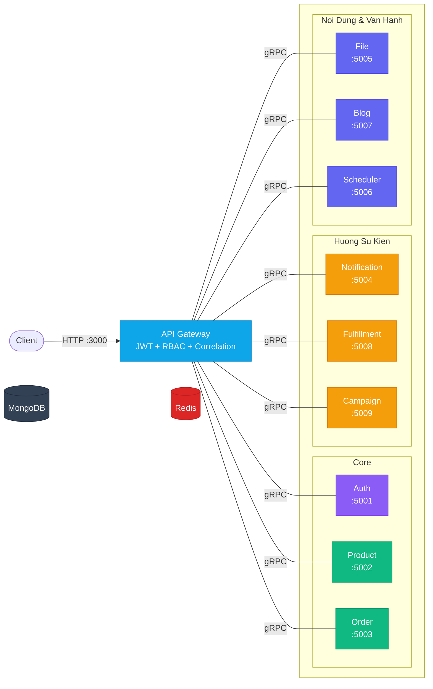
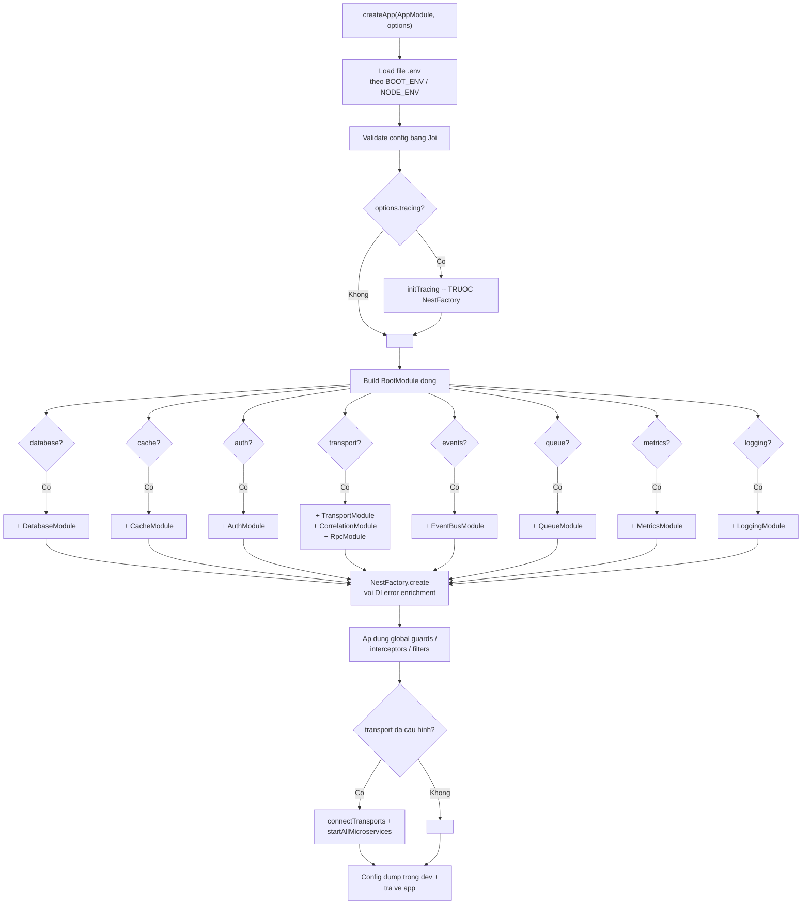

# nestjs-boot

> Framework microservice NestJS sẵn sàng cho production. Một config object, zero wiring.

[](https://www.npmjs.com/package/nestjs-boot)
[](https://opensource.org/licenses/MIT)
[](#)
[](#modules)

> [English version](README.md)

## nestjs-boot la gi?

`nestjs-boot` la mot **runtime package** (khong phai template hay boilerplate). Ban cai no nhu dependency, goi `createApp(AppModule, config)`, va no tu dong wire database, cache, auth, transport, queue, event, health check, metrics, tracing, va nhieu thu khac — dua tren nhung gi ban cau hinh. Moi module deu optional: bo qua phan config = module do khong duoc load. `AppModule` cua ban chi co business logic.

## Bat Dau Nhanh

### Cach 1: Tao project moi (CLI tuong tac)

```bash
npx nestjs-boot new my-service
cd my-service
npm install
npm run start:dev
```

CLI se hoi ban chon database (MongoDB, PostgreSQL, MySQL, DynamoDB, Elasticsearch), cache (Redis, Memcached), auth (JWT), va transport (HTTP, gRPC, TCP, NATS, RabbitMQ). Hoac truyen flags truc tiep:

```bash
npx nestjs-boot new my-service --db=postgres --cache=redis --auth=jwt --transport=grpc
npx nestjs-boot new my-service -y  # mac dinh: MongoDB + Redis + JWT + HTTP
```

Thu nghiem:

```bash
curl http://localhost:3000/health       # kiem tra suc khoe
curl http://localhost:3000/metrics      # Prometheus metrics
```

### Cach 2: Chay vi du 10 services

```bash
git clone https://github.com/nthanhdo/nestjs-boot.git
cd nestjs-boot/examples/microservices
docker-compose up --build
```

Khoi dong 10 services + MongoDB + Redis giao tiep qua gRPC. Xem chi tiet tai [examples/microservices/](examples/microservices/).

## Kien Truc



## `createApp()` -- Cach Hoat Dong

**Truoc** -- wire thu cong (~40 dong infrastructure moi service):

```ts
@Module({
  imports: [
    MongooseModule.forRootAsync({ connectionName: 'master_writer', useFactory: () => ({ uri: '...' }) }),
    MongooseModule.forRootAsync({ connectionName: 'master_reader', useFactory: () => ({ uri: '...' }) }),
    CacheModule.register({ store: redisStore, url: '...' }),
    ConfigModule.forRoot({ validationSchema: Joi.object({ /* ... */ }) }),
    TerminusModule.forRoot(),
    // + interceptors, filters, health indicators ...
  ],
})
export class AppModule {}
```

**Sau** -- mot config object trong `main.ts`:

```ts
import { createApp } from 'nestjs-boot';
import { AppModule } from './app.module';

const app = await createApp(AppModule, {
  database: {
    connections: {
      master: { writerUri: process.env.MONGO_URI!, readerUri: process.env.MONGO_READER_URI },
    },
  },
  cache: { redis: { url: process.env.REDIS_URL! }, defaultTtl: 300 },
  auth: { jwt: { secret: process.env.JWT_SECRET! } },
  health: { enabled: true },
  response: { envelope: true },
});

await app.listen(3000);
```

### Trinh Tu Khoi Dong



## Cac Module

### Database

Ket noi nhieu MongoDB voi tu dong chia doc/ghi (reader/writer split). `BaseRepository<T>` cung cap CRUD + phan trang voi tu dong dinh tuyen ket noi. `CachedBaseRepository<T>` them cache-aside. `CrudService<T>` co lifecycle hooks (`beforeCreate`, `afterCreate`, v.v.). `UnitOfWork` ho tro MongoDB transactions. `Specification<T>` cho composable query filters.

```ts
database: {
  connections: {
    master: { writerUri: 'mongodb://primary:27017/app', readerUri: 'mongodb://replica:27017/app' },
    analytics: { writerUri: 'mongodb://analytics:27017/metrics' },
  },
}
```

**Migration:** `MigrationRunner` voi `_migrations` collection theo doi trang thai. CLI: `npx nestjs-boot migrate`, `migrate:create`, `migrate:rollback`, `migrate:status`.

### Cache

L1 in-memory LRU + L2 Redis (tuy chon). Dinh tuyen theo kich thuoc (>1MB chi luu L2). Ho tro Memcached cho L1. `MultiCacheService` cung cap `getOrSet()`, `del()`, `delByPrefix()`.

**Nang cao:** `CacheStampedeGuard` (chong thundering herd — chi 1 request goi DB khi cache het han), `CacheWarmer` (lam nong cache khi khoi dong), `TaggedCacheService` (vo hieu theo tag), `CacheStats` (thong ke hit rate).

```ts
cache: { redis: { url: 'redis://localhost:6379' }, defaultTtl: 300 }
```

### Auth

Bo xac thuc day du: JWT (access + refresh + thu hoi token), API key, RBAC (`@Roles`, `@Permissions`), `@Public()`, `@CurrentUser()`.

- **Social/OAuth2:** `SocialAuthModule` voi `GoogleStrategy` va `GitHubStrategy`.
- **TOTP:** `TotpService` cho xac thuc 2 yeu to (tao secret, xac minh token).
- **Session:** `SessionAuthModule` voi `SessionStore` co the thay the va `@Session()`.
- **WebSocket:** `WsJwtGuard` cho ket noi WebSocket co xac thuc.
- **Token lifecycle:** `signPasswordReset()`, `signEmailVerification()`, `rotateRefreshToken()`.

```ts
auth: {
  jwt: { secret: '...', refreshSecret: '...', refreshExpiresIn: '7d' },
  apiKey: { enabled: true, validate: async (key) => isValid(key) },
  rbac: { enabled: true },
}
```

### Transport

Cau hinh hybrid HTTP + gRPC/TCP/NATS/RabbitMQ. `ServiceClient<T>` cung cap goi RPC type-safe voi tu dong chuyen tiep correlation ID. `createResilientClient()` boc client voi circuit breaker + retry. `ServiceDiscoveryHook` ho tro phan giai service dong.

```ts
transport: {
  grpc: { url: '0.0.0.0:5000', package: 'product', protoPath: 'product.proto' },
  clients: {
    PRODUCT_SERVICE: { transport: 'grpc', options: { url: 'product:5000', package: 'product', protoPath: 'product.proto' } },
  },
}
```

### Quan Sat (Observability)

- **Metrics:** Prometheus endpoint qua `MetricsModule`. Tu dong do HTTP, DB, Cache, Queue.
- **Logging:** Pino co cau truc qua `LoggingModule`. Tu dong gan correlationId vao moi log.
- **Tracing:** OpenTelemetry qua `TracingModule`. `@BootTrace('ten')` tu dong tao span. `initTracing()` chay truoc NestFactory.
- **Correlation:** `X-Correlation-Id` lan truyen giua cac service qua `AsyncLocalStorage`.
- **Grafana:** 3 dashboard templates (HTTP overview, service health, microservice overview) + alert rules.

```ts
metrics: { enabled: true, path: '/metrics', prefix: 'myapp_' },
logging: { level: 'info', pretty: true, redact: ['req.headers.authorization'] },
tracing: { exporter: 'otlp', endpoint: 'http://jaeger:4318', sampleRate: 0.1 },
```

### Kha Nang Phuc Hoi (Resilience)

`@CircuitBreaker()` boc method voi may trang thai dong/mo/nua-mo. `@Retry({ attempts: 3, backoff: 'exponential' })` tu dong thu lai. `@Timeout(5000)` gioi han thoi gian moi method.

### Xu Ly Loi

`AllExceptionsFilter` cho loi HTTP co cau truc. `BootRpcExceptionFilter` cho gRPC voi anh xa trang thai HTTP↔gRPC. `BootException` them truong `code` + `details` on dinh. `MongooseErrorInterceptor` chuyen doi loi duplicate-key va validation. `toProblemDetails()` xuat theo RFC 9457. `ErrorReporter` tich hop Sentry/Datadog. `errorBoundary()` boc goi async voi fallback.

```ts
throw new BootException('Khong tim thay', { code: ErrorCodes.NOT_FOUND, status: 404 });
```

### Queue & Su Kien

- **Queue:** BullMQ voi `@Processor`, `@Process`, `@OnFailed`, `@OnCompleted`. `QueueService.addJob()` de them vao hang doi.
- **Su kien:** Event bus trong process hoac Redis pub/sub. `BootEvent` cho fire-and-forget. `BootQuery` cho request/response (`emitAndWait`).

### CQRS & Event Sourcing

- **CommandBus:** Dinh tuyen 1:1 command toi handler qua `@CommandHandler`.
- **AggregateRoot:** Pattern DDD voi `apply()`, `loadFromHistory()`, quan ly version.
- **EventStore:** MongoDB + memory adapter, interface cho EventStoreDB/Kafka.
- **Projection:** `@OnDomainEvent` xay dung read model tu dong khi stream.
- **Outbox:** Ghi event vao DB cung transaction, publish bat dong bo — dam bao at-least-once.
- **Saga:** `defineSaga()` builder voi bu tru nguoc (reverse compensations).

### Cau Hinh

Joi validation, `.env` + `.env.{BOOT_ENV}` profiles, `BootConfigService` truy cap kieu dot-notation. Load bat dong bo qua `registerAsync()`. Adapter: `AwsSecretsAdapter`, `VaultAdapter`, `EnvFileAdapter`. `ConfigWatcher` cho dev hot-reload. `generateConfigDocs()` xuat tai lieu config.

### An Toan DI (Dependency Injection)

- **Lam giau loi:** `parseDiError()` + `formatDiError()` bien loi DI kho hieu thanh huong dan sua cu the.
- **Contract:** `createContract<T>()` dinh nghia DI token dua tren interface. Tranh circular dep.
- **Phan tich do thi:** `analyzeModules()` + `detectCycles()` (Tarjan's SCC) + `renderMermaid()`.
- **Lop module:** `@Layer(ModuleLayer.DOMAIN)` + `validateLayers()` ngan import nguoc.

### Multi-tenancy

3 chien luoc cach ly: row-level (chung collection, filter theo `tenantId`), schema-level (prefix collection), database-level (connection rieng moi tenant). `TenantAwareRepository` tu dong scope query. `@CurrentTenant()` decorator.

### API Versioning

URI / header / media-type versioning. `@DeprecatedVersion('2027-01-01')` them header Sunset.

### Swagger/OpenAPI

Tu dong cau hinh tu `package.json`. Them auth scheme khi AuthModule duoc cau hinh. `@ApiPaginated`, `@ApiErrorResponses`, `AutoApiProperties()`.

### WebSocket

Redis adapter cho scaling nhieu instance. `BootWsGateway` base class. `WsCorrelationInterceptor` gan correlationId moi message.

### Thanh Toan (Webhooks)

Xac minh signature Stripe/PayPal (HMAC-SHA256). `IdempotencyGuard` ngan xu ly trung. Custom provider qua interface.

### Luu Tru File

Adapter: local / S3 / GCS. `FileValidationPipe` kiem tra mime + size truoc upload. `getSignedUrl()` cho URL tam thoi.

### Kiem Thu (Testing)

`createTestSuite()` — quan ly lifecycle day du. `createFactory<T>()` — factory voi traits, sequence, `afterCreate` hook. `createTestClient()` — supertest voi typed response. `createGrpcTestClient()` — test gRPC in-process. `createMessageDispatcher()` — test message pattern. `ContractVerifier` — xac minh contract. `expectSnapshot()` — snapshot testing. `createTestJwt()` + `MockAuthModule` — auth test helper.

### Health & Shutdown

Health tu dong phat hien driver (MongoDB, Redis). Tra 503 khi dang shutdown. `ShutdownModule` drain request, dong ket noi, flush queue. Nhan biet K8s voi preStop delay.

## Lenh CLI

```bash
npx nestjs-boot new <ten>                    # tao project moi (tuong tac)
npx nestjs-boot new <ten> -y                 # mac dinh, khong hoi
npx nestjs-boot new <ten> --db=postgres      # chon database
npx nestjs-boot g resource <ten>             # tao CRUD resource
npx nestjs-boot g resource <ten> --grpc      # resource voi gRPC
npx nestjs-boot graph                        # do thi dependency (Mermaid)
npx nestjs-boot graph --strict               # thoat 1 neu co cycle (CI)
npx nestjs-boot migrate                      # chay migration
npx nestjs-boot migrate:create <ten>         # tao migration moi
npx nestjs-boot migrate:rollback             # rollback migration cuoi
npx nestjs-boot migrate:status               # trang thai migration
```

## Cau Hinh Day Du

```ts
interface BootOptions {
  database?: { connections: Record<string, { writerUri: string; readerUri?: string; options?: object }> };
  cache?: { redis?: { url: string }; memcached?: { servers: string }; defaultTtl?: number };
  auth?: { jwt?: { secret: string; refreshSecret?: string }; apiKey?: { enabled: boolean; validate: Function }; rbac?: { enabled: boolean } };
  transport?: { grpc?: object; tcp?: object; nats?: object; rabbitmq?: object; clients?: Record<string, object> };
  events?: { transport: 'memory' | 'redis'; redis?: { url: string } };
  queue?: { driver: 'bullmq'; redis: { url: string } };
  cqrs?: { eventStore: 'mongodb' | 'memory'; snapshotStore?: string; outbox?: { enabled: boolean } };
  metrics?: { enabled?: boolean; path?: string; prefix?: string };
  logging?: { level?: string; pretty?: boolean; redact?: string[] };
  tracing?: { exporter: string; endpoint?: string; sampleRate?: number };
  correlation?: { header?: string };
  resilience?: { circuitBreaker?: object; timeout?: { default?: number } };
  health?: { enabled?: boolean; path?: string };
  shutdown?: { timeout?: number; signals?: string[] };
  response?: { envelope?: boolean; errorHandler?: boolean };
  interServiceAuth?: { propagation?: boolean; serviceToken?: string };
  monitoring?: { errorReporter?: Function };
  versioning?: { type: 'uri' | 'header' | 'media-type'; defaultVersion?: string };
  tenancy?: { strategy: 'header' | 'subdomain' | 'path'; isolation: 'database' | 'schema' | 'row' };
  swagger?: { enabled?: boolean; path?: string; title?: string };
  websocket?: { adapter?: string; redis?: { url: string } };
  storage?: { driver: 'local' | 's3' | 'gcs'; local?: object; s3?: object; gcs?: object };
  webhooks?: { providers: object };
  layers?: { enabled?: boolean; strict?: boolean };
  lazy?: boolean;
}
```

Moi phan deu optional. Bo qua = module khong duoc load.

## Huong Dan

- [Ngan Chan Circular Dependency](docs/guides/circular-dependency-prevention.md)
- [Thuc Hanh Tot DI](docs/guides/di-best-practices.md)
- [Huong Dan Kiem Thu](docs/guides/testing-guide.md)
- [Chon Transport](docs/guides/transport-selection.md)
- [Auth & Rate Limiting](docs/guides/auth-rate-limiting.md)
- [Checklist Production](docs/guides/production-checklist.md)
- [Luu Y Serverless](docs/guides/serverless-considerations.md)

## Vi Du

- **[Kien truc 10 microservices](examples/microservices/)** — API Gateway + 9 services, gRPC, EventBus, BullMQ
- **[Skeleton hoc tap](examples/learning/)** — 12 bai hoc, 10 bai tap, loi giai day du

## Cong Cu

- **[Web Generator](packages/web-generator/)** — tao project trong trinh duyet, xuat ZIP
- **[Admin Dashboard](packages/admin-dashboard/)** — quan ly va giam sat truc quan

## Su Dung Doc Lap

Dung bat ky module nao ma khong can `createApp()`:

```ts
import { DatabaseModule, CacheModule, AuthModule } from 'nestjs-boot';

@Module({
  imports: [
    DatabaseModule.register({ connections: { master: { writerUri: '...' } } }),
    CacheModule.register({ redis: { url: '...' }, defaultTtl: 600 }),
    AuthModule.register({ jwt: { secret: '...' } }),
  ],
})
export class AppModule {}
```

## Dong Gop

```bash
git clone https://github.com/nthanhdo/nestjs-boot.git
cd nestjs-boot
npm install
npm test           # 507 tests
npm run build      # CJS + ESM + DTS
```

## Giay Phep

[MIT](LICENSE)
