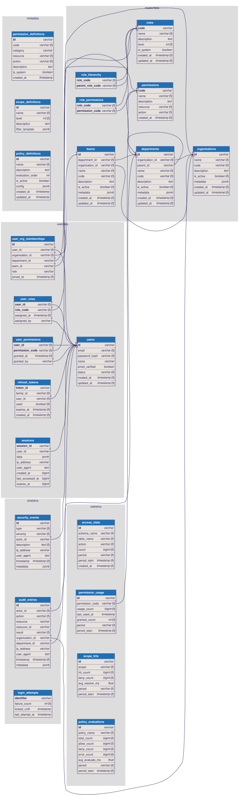

# nestjs-boot Diagrams

Architectural diagrams for nestjs-boot. Mermaid diagrams render natively on GitHub. SVG diagrams render inline.

## Database Schema (ER Diagram)

> 17 tables across 4 groups: Auth, Tokens, Organization, Audit.



**Source:** [database-schema.dbml](database-schema.dbml) — edit at [dbdiagram.io](https://dbdiagram.io) or any DBML editor.

**Regenerate SVG:**
```bash
npx @softwaretechnik/dbml-renderer -i docs/diagrams/database-schema.dbml -o docs/diagrams/database-schema.svg
```

## Other Diagrams

| Diagram | Format | Description |
|---------|--------|-------------|
| [Auth Flow](auth-flow.md) | Mermaid | Guard pipeline, permission resolution, token refresh, login state machine |
| [Module Dependencies](module-dependencies.md) | Mermaid | 60+ module map, DB driver selection, auth stack composition, boot sequence |
| [Database Schema (Mermaid)](database-schema.md) | Mermaid | Same ER in Mermaid erDiagram format (simpler, text-only) |
