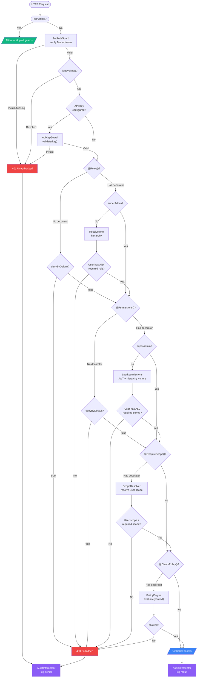
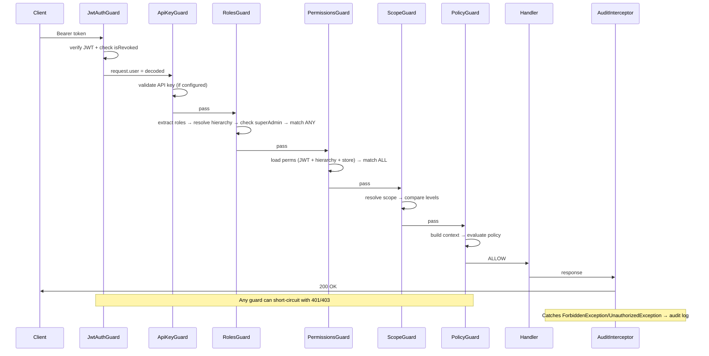
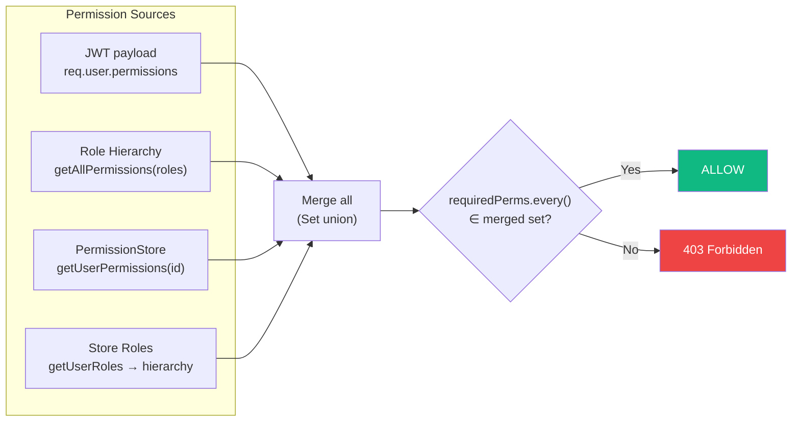
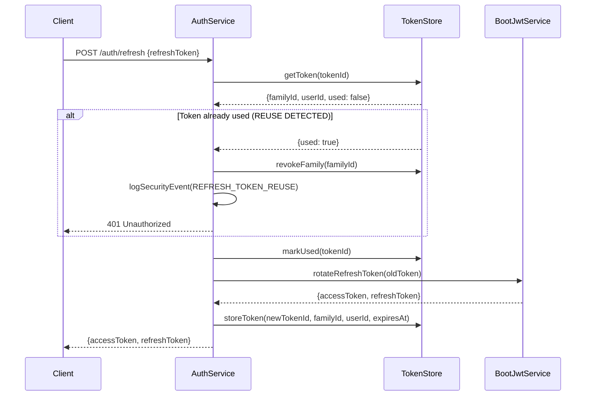
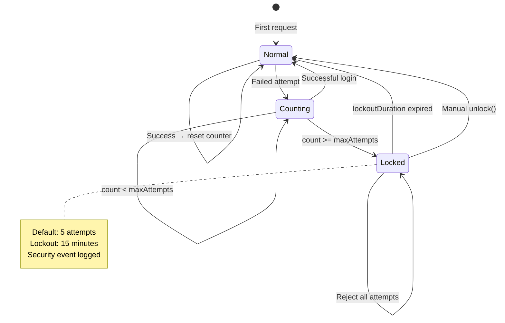

# Authentication & Authorization Flow

> How every protected request is evaluated in nestjs-boot.

## Request Pipeline

## Guard Execution Order

## Permission Resolution

## Token Refresh Flow

## Login Attempt Tracking

