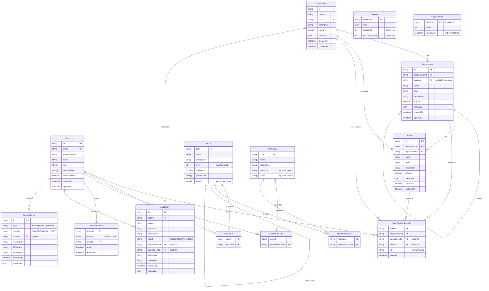
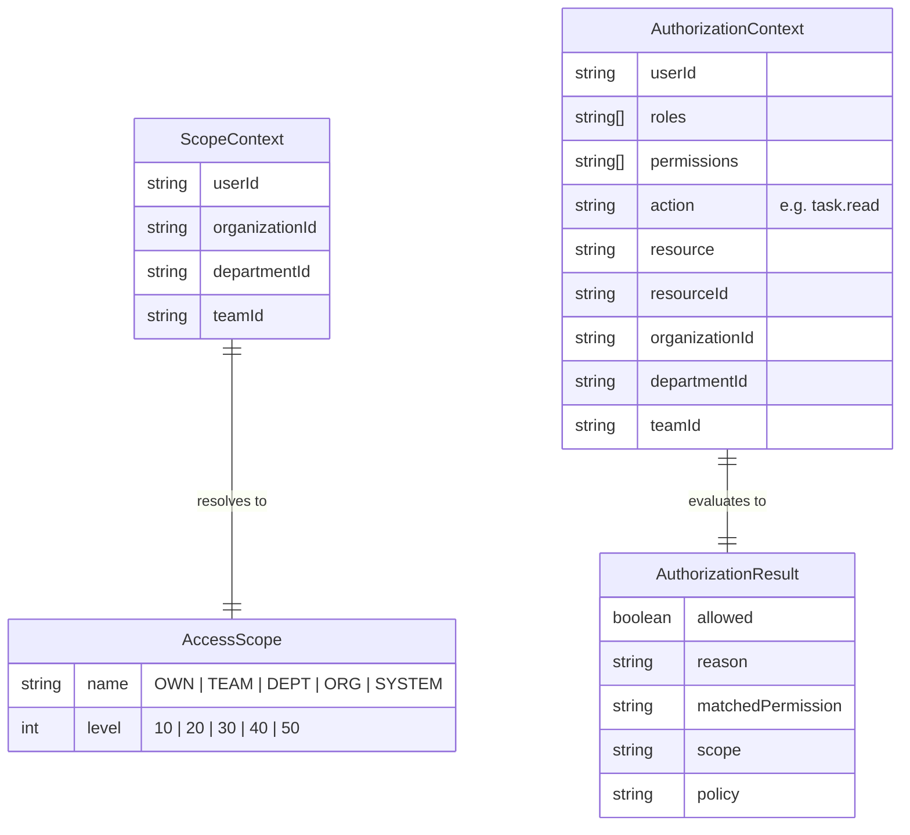
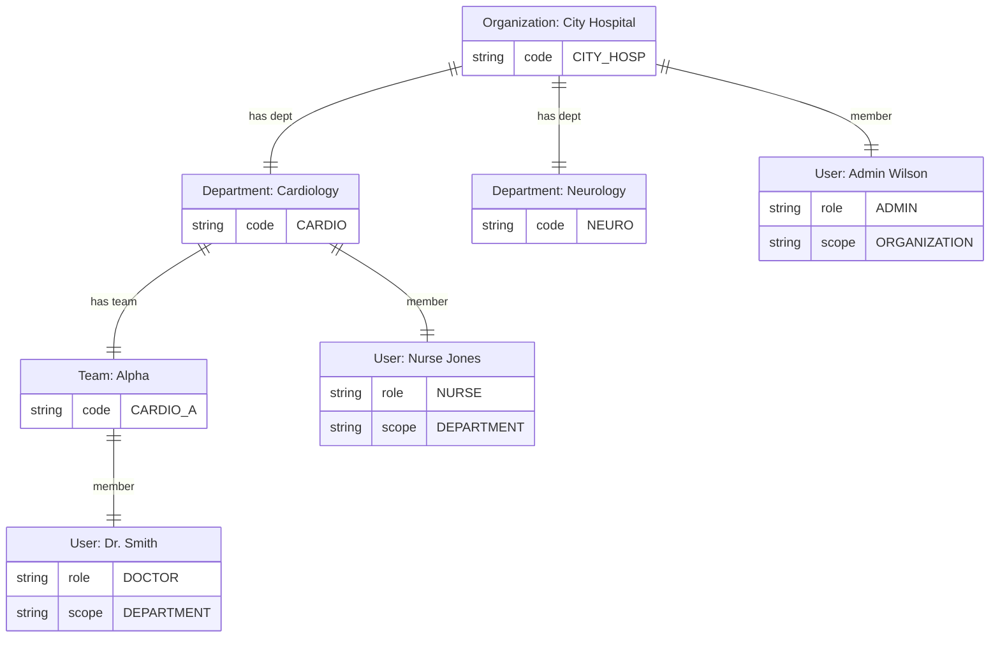

# Database Schema

> Entity-Relationship diagram for all persistable entities in nestjs-boot.
> These are framework interfaces — implement with Mongoose, Prisma, or any ORM.

## Full Schema

## Scope & Access Model

## Healthcare Example

How a hospital maps to this schema:

**Access rules:**
- Dr. Smith (DEPARTMENT scope) can read patients in Cardiology, NOT Neurology
- Nurse Jones (DEPARTMENT scope) can read patients in Cardiology
- Admin Wilson (ORGANIZATION scope) can manage users across the entire hospital
- SUPER_ADMIN (SYSTEM scope) has unrestricted access

## Notes

- All IDs should be UUID or another non-sequential identifier
- All entities include `createdAt` / `updatedAt` timestamps
- Foreign keys with "optional" can be null
- `metadata` fields are JSON blobs for domain-specific extensions
- The framework ships in-memory stores (`MemoryPermissionStore`, `MemoryOrganizationStore`, `MemoryAuditStore`, `MemoryTokenStore`) for dev/test. Production implementations use your ORM of choice.
