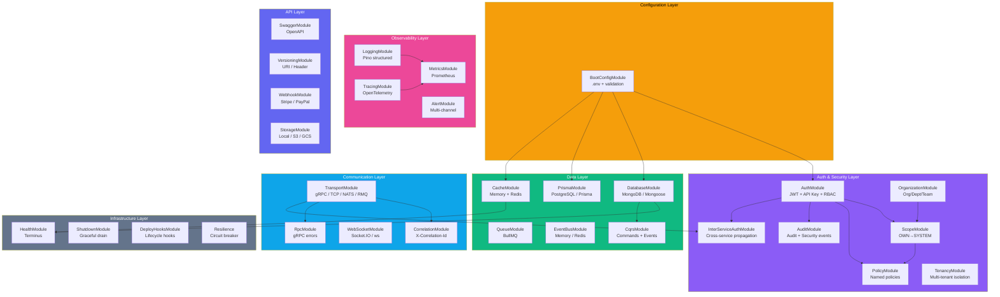
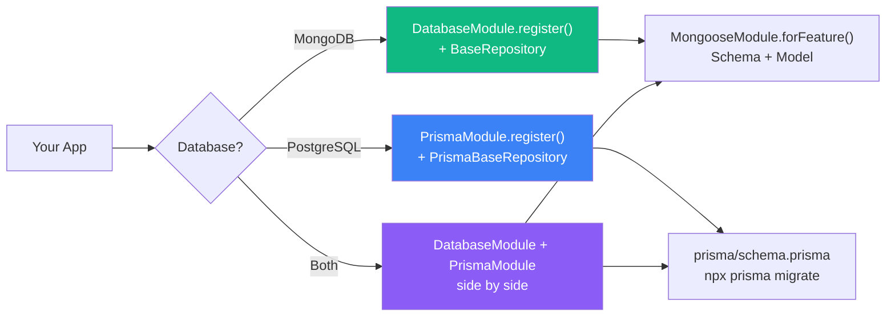
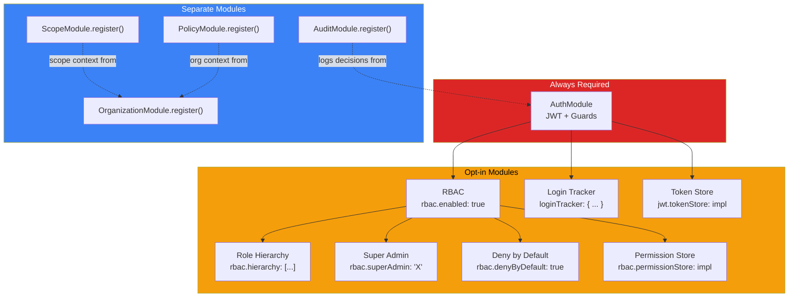
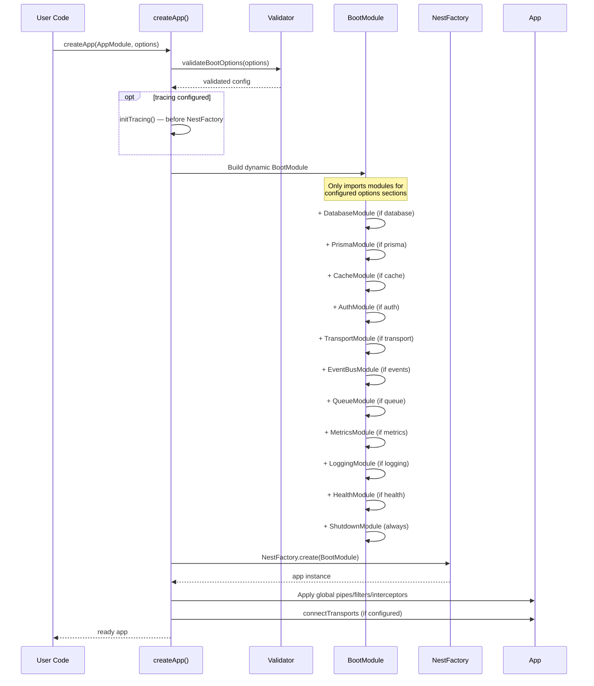

# Module Dependencies

> How nestjs-boot modules wire together. All modules are optional — omit config = not loaded.

## Core Module Map

## Database Driver Selection

## Auth Stack Composition

## `createApp()` Boot Sequence

