# nestjs-boot Microservices Example

Ten interconnected microservices demonstrating `nestjs-boot`'s config-driven bootstrap with `createApp()`.

## Architecture

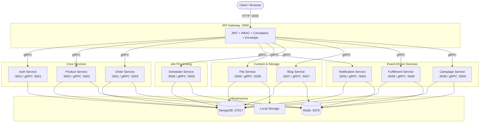

All inter-service communication uses gRPC. The API Gateway is the only HTTP entry point.

## Request Flow

How a typical authenticated request travels through the system:

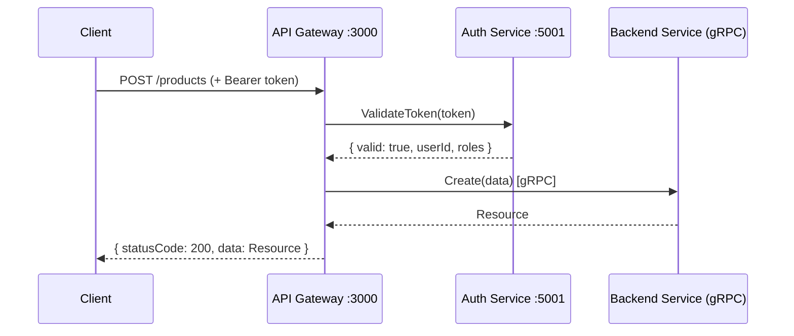

## Event Flow

How events propagate across services (e.g., creating an order):

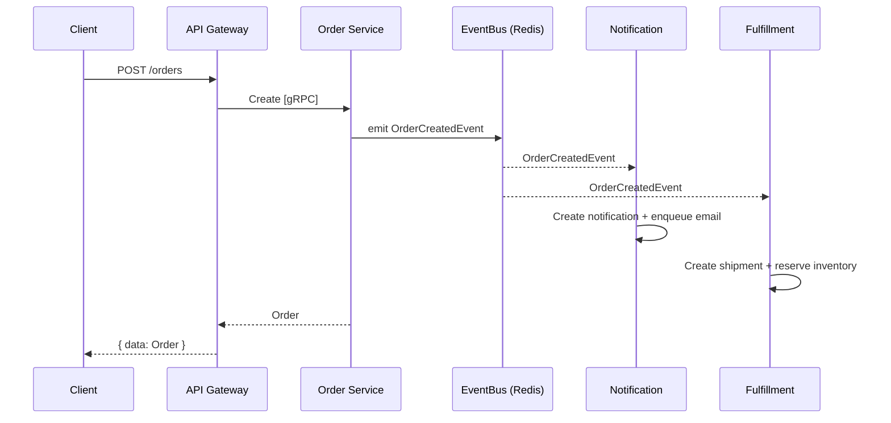

## nestjs-boot Features Demonstrated

| Feature | Gateway | Auth | Product | Order | Notification | File | Scheduler | Blog | Fulfillment | Campaign |
|---------|:-------:|:----:|:-------:|:-----:|:------------:|:----:|:---------:|:----:|:-----------:|:--------:|
| `createApp()` | x | x | x | x | x | x | x | x | x | x |
| JWT Auth (`BootJwtService`) | x | x | | | | | | | | |
| Correlation ID | x | x | x | x | x | x | x | x | x | x |
| gRPC Client | x | | | | | | | | | |
| gRPC Server | | x | x | x | x | x | x | x | x | x |
| DatabaseModule | | x | x | x | x | x | x | x | x | x |
| CacheModule (L1+L2) | | | x | x | | | x | x | x | x |
| HealthModule | x | x | x | x | x | x | x | x | x | x |
| Response Envelope | x | | | | | | | | | |
| Error Handler | | x | x | x | x | x | x | x | x | x |
| EventBus (`@OnEvent`) | | | | | x | | | | x | x |
| Queue (`@Processor`) | | | | | x | | x | | x | |

## Quick Start

```bash
docker-compose up --build
```

This starts 12 containers (10 services + MongoDB + Redis):

| Service | HTTP | gRPC | Purpose |
|---------|------|------|---------|
| API Gateway | [:3000](http://localhost:3000) | - | HTTP entry point, JWT, routing |
| Auth Service | :3003 | :5001 | User registration, login, JWT tokens |
| Product Service | :3002 | :5002 | Product CRUD with L1+L2 cache |
| Order Service | :3001 | :5003 | Order management |
| Notification Service | :3004 | :5004 | Event-driven notifications, BullMQ |
| File Service | :3005 | :5005 | File upload and storage |
| Scheduler Service | :3006 | :5006 | Cron-like scheduled jobs via BullMQ |
| Blog Service | :3007 | :5007 | Blog articles with Redis cache |
| Fulfillment Service | :3008 | :5008 | Order fulfillment pipeline, events + queue |
| Campaign Service | :3009 | :5009 | Promo campaigns with event-driven lifecycle |
| MongoDB | :27017 | - | Shared database engine |
| Redis | :6379 | - | Cache, queues, events |

## Try It

Complete walkthrough exercising all 10 services.

### 1. Register a user

```bash
curl -s -X POST http://localhost:3000/auth/register \
  -H 'Content-Type: application/json' \
  -d '{"email":"test@test.com","password":"123456","name":"Test User"}'
```

### 2. Login

```bash
TOKEN=$(curl -s -X POST http://localhost:3000/auth/login \
  -H 'Content-Type: application/json' \
  -d '{"email":"test@test.com","password":"123456"}' | jq -r '.data.accessToken')

echo $TOKEN
```

### 3. Create a product

```bash
curl -s -X POST http://localhost:3000/products \
  -H 'Content-Type: application/json' \
  -H "Authorization: Bearer $TOKEN" \
  -d '{"name":"Wireless Mouse","price":29.99,"category":"electronics","stock":150}'
```

### 4. List products

```bash
curl -s 'http://localhost:3000/products?category=electronics&page=1&limit=10'
```

### 5. Create a blog article

```bash
curl -s -X POST http://localhost:3000/blog/articles \
  -H 'Content-Type: application/json' \
  -H "Authorization: Bearer $TOKEN" \
  -d '{
    "title": "Getting Started with Microservices",
    "content": "This guide walks you through building a 10-service architecture...",
    "tags": ["microservices", "nestjs", "tutorial"],
    "authorId": "user-123"
  }'
```

### 6. Upload a file (cover image)

```bash
curl -s -X POST http://localhost:3000/files/upload \
  -H "Authorization: Bearer $TOKEN" \
  -F 'file=@./cover.png'
```

### 7. Create a campaign with promo code

```bash
curl -s -X POST http://localhost:3000/campaigns \
  -H 'Content-Type: application/json' \
  -H "Authorization: Bearer $TOKEN" \
  -d '{
    "name": "Summer Sale 2026",
    "promoCode": "SUMMER20",
    "discountPercent": 20,
    "startDate": "2026-08-01T00:00:00Z",
    "endDate": "2026-08-31T23:59:59Z"
  }'
```

### 8. Create an order with promo

```bash
curl -s -X POST http://localhost:3000/orders \
  -H 'Content-Type: application/json' \
  -H "Authorization: Bearer $TOKEN" \
  -d '{
    "userId": "user-123",
    "items": [{"productId": "<product-id>", "quantity": 2, "price": 29.99}],
    "promoCode": "SUMMER20"
  }'
```

This triggers the Fulfillment Service (picks up the order) and the Notification Service (sends confirmation).

### 9. Check fulfillment status

```bash
curl -s http://localhost:3000/fulfillment/orders/<order-id>/shipment \
  -H "Authorization: Bearer $TOKEN"
```

### 10. Check notifications

```bash
curl -s 'http://localhost:3000/notifications?userId=user-123'
```

### 11. Create a scheduled job

```bash
curl -s -X POST http://localhost:3000/scheduler/jobs \
  -H 'Content-Type: application/json' \
  -H "Authorization: Bearer $TOKEN" \
  -d '{
    "name": "daily-report",
    "cron": "0 9 * * *",
    "handler": "generateDailyReport",
    "data": {"reportType": "sales"}
  }'
```

### 12. Health check all services

```bash
curl -s http://localhost:3000/health | jq
```

---

## Service Details

---

### 1. API Gateway

> HTTP entry point for all external requests. Routes to 9 backend services via gRPC.

**Port:** HTTP :3000

**nestjs-boot features used:**
- JWT Auth (token validation via Auth Service)
- Correlation ID propagation (`X-Correlation-Id`)
- Response Envelope (`{ statusCode, message, data }`)
- Global Error Handler
- gRPC Clients (9 connections)
- Health Check

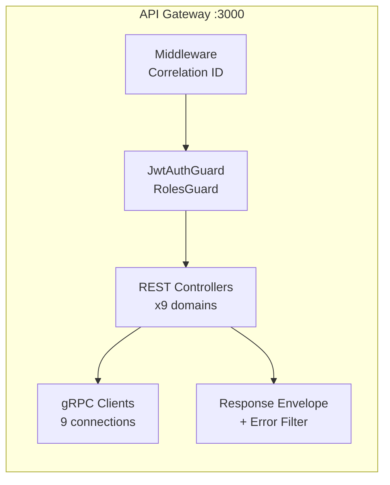

**`createApp()` config:**
```ts
{
  auth: { jwt: { secret: process.env.JWT_SECRET } },
  correlation: { header: 'X-Correlation-Id' },
  transport: { clients: { AUTH_SERVICE, PRODUCT_SERVICE, ORDER_SERVICE, ... } },
  health: { enabled: true },
  response: { envelope: true, errorHandler: true },
}
```

**API Routes:**

| Method | Route | Auth | Proxies to |
|--------|-------|:----:|------------|
| `POST` | `/auth/register` | No | Auth Service |
| `POST` | `/auth/login` | No | Auth Service |
| `GET` | `/auth/validate` | Yes | Auth Service |
| `POST` | `/auth/refresh` | No | Auth Service |
| `GET` | `/products` | No | Product Service |
| `GET` | `/products/:id` | No | Product Service |
| `POST` | `/products` | Yes | Product Service |
| `GET` | `/orders` | Yes | Order Service |
| `GET` | `/orders/:id` | Yes | Order Service |
| `POST` | `/orders` | Yes | Order Service |
| `GET` | `/notifications` | No | Notification Service |
| `PATCH` | `/notifications/:id/read` | Yes | Notification Service |
| `POST` | `/files/upload` | Yes | File Service |
| `GET` | `/files/:id` | No | File Service |
| `GET` | `/files` | No | File Service |
| `DELETE` | `/files/:id` | Yes | File Service |
| `POST` | `/scheduler/jobs` | Yes | Scheduler Service |
| `GET` | `/scheduler/jobs` | No | Scheduler Service |
| `GET` | `/scheduler/jobs/:id` | No | Scheduler Service |
| `PATCH` | `/scheduler/jobs/:id/pause` | Yes | Scheduler Service |
| `PATCH` | `/scheduler/jobs/:id/resume` | Yes | Scheduler Service |
| `POST` | `/scheduler/jobs/:id/trigger` | Yes | Scheduler Service |
| `DELETE` | `/scheduler/jobs/:id` | Yes | Scheduler Service |
| `POST` | `/blog/articles` | Yes | Blog Service |
| `PUT` | `/blog/articles/:id` | Yes | Blog Service |
| `GET` | `/blog/articles/:slug` | No | Blog Service |
| `GET` | `/blog/articles` | No | Blog Service |
| `DELETE` | `/blog/articles/:id` | Yes | Blog Service |
| `GET` | `/blog/categories` | No | Blog Service |
| `GET` | `/blog/tags` | No | Blog Service |
| `POST` | `/fulfillment/shipments` | Yes | Fulfillment Service |
| `GET` | `/fulfillment/shipments/:id` | No | Fulfillment Service |
| `GET` | `/fulfillment/shipments` | No | Fulfillment Service |
| `GET` | `/fulfillment/orders/:orderId/shipment` | No | Fulfillment Service |
| `PATCH` | `/fulfillment/shipments/:id/status` | Yes | Fulfillment Service |
| `POST` | `/fulfillment/inventory/reserve` | Yes | Fulfillment Service |
| `POST` | `/fulfillment/inventory/release` | Yes | Fulfillment Service |
| `POST` | `/campaigns` | Yes | Campaign Service |
| `GET` | `/campaigns` | No | Campaign Service |
| `GET` | `/campaigns/:id` | No | Campaign Service |
| `PUT` | `/campaigns/:id` | Yes | Campaign Service |
| `DELETE` | `/campaigns/:id` | Yes | Campaign Service |
| `POST` | `/campaigns/:id/activate` | Yes | Campaign Service |
| `POST` | `/campaigns/:id/deactivate` | Yes | Campaign Service |
| `POST` | `/campaigns/promo/validate` | No | Campaign Service |
| `POST` | `/campaigns/promo/apply` | Yes | Campaign Service |
| `GET` | `/campaigns/:id/stats` | No | Campaign Service |
| `GET` | `/health` | No | Local |

**Environment Variables:**
| Var | Default | Description |
|-----|---------|-------------|
| `JWT_SECRET` | `dev-secret-change-in-production` | JWT signing secret |
| `AUTH_SERVICE_URL` | `localhost:5001` | Auth gRPC endpoint |
| `PRODUCT_SERVICE_URL` | `localhost:5002` | Product gRPC endpoint |
| `ORDER_SERVICE_URL` | `localhost:5003` | Order gRPC endpoint |
| `NOTIFICATION_SERVICE_URL` | `localhost:5004` | Notification gRPC endpoint |
| `FILE_SERVICE_URL` | `localhost:5005` | File gRPC endpoint |
| `SCHEDULER_SERVICE_URL` | `localhost:5006` | Scheduler gRPC endpoint |
| `BLOG_SERVICE_URL` | `localhost:5007` | Blog gRPC endpoint |
| `FULFILLMENT_SERVICE_URL` | `localhost:5008` | Fulfillment gRPC endpoint |
| `CAMPAIGN_SERVICE_URL` | `localhost:5009` | Campaign gRPC endpoint |

---

### 2. Auth Service

> User registration, login, and JWT token management with bcrypt password hashing.

**Port:** HTTP :3003 | gRPC :5001 (internal :5000)

**nestjs-boot features used:**
- DatabaseModule (MongoDB `auth` database)
- `BootJwtService` (access token 15m + refresh token 7d)
- gRPC Server
- Correlation ID
- Health Check

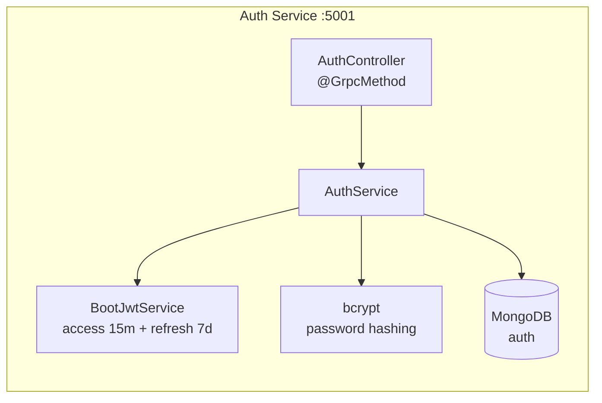

**gRPC Methods:**
| Method | Request | Response | Description |
|--------|---------|----------|-------------|
| `Login` | `LoginRequest` | `AuthResponse` | Authenticate user, return access + refresh tokens |
| `Register` | `RegisterRequest` | `UserResponse` | Create new user with hashed password |
| `ValidateToken` | `ValidateTokenRequest` | `ValidationResponse` | Verify JWT, return userId and roles |
| `RefreshToken` | `RefreshTokenRequest` | `AuthResponse` | Issue new access token from refresh token |

**`createApp()` config:**
```ts
{
  database: { connections: { master: { writerUri: process.env.MONGO_URI } } },
  auth: {
    jwt: { secret: '...', signOptions: { expiresIn: '15m' },
           refreshSecret: '...', refreshExpiresIn: '7d' },
  },
  transport: { grpc: { url: '0.0.0.0:5000', package: 'auth', protoPath: 'auth.proto' } },
  correlation: {},
  health: { enabled: true },
  response: { errorHandler: true },
}
```

**Environment Variables:**
| Var | Default | Description |
|-----|---------|-------------|
| `MONGO_URI` | `mongodb://localhost:27017/auth` | MongoDB connection |
| `JWT_SECRET` | `dev-secret-change-in-production` | Access token signing secret |
| `JWT_REFRESH_SECRET` | `dev-refresh-secret` | Refresh token signing secret |

---

### 3. Product Service

> Product CRUD with L1 in-memory + L2 Redis cache-aside pattern.

**Port:** HTTP :3002 | gRPC :5002 (internal :5000)

**nestjs-boot features used:**
- DatabaseModule (MongoDB `products` database)
- CacheModule (L1 memory + L2 Redis, 300s TTL)
- gRPC Server
- Correlation ID
- Health Check

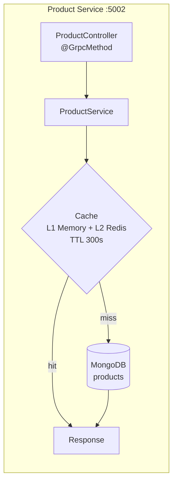

**gRPC Methods:**
| Method | Request | Response | Description |
|--------|---------|----------|-------------|
| `FindOne` | `ProductById` | `Product` | Get product by ID (cache-first) |
| `FindAll` | `ProductFilter` | `ProductList` | List/search products with filters |
| `Create` | `CreateProductRequest` | `Product` | Create new product |

**Key Implementation Patterns:**
- Cache-aside: `getOrSet(key, factory)` checks L1 (in-process LRU) then L2 (Redis) before hitting MongoDB
- Cache HIT/MISS logged for observability
- Size-aware routing: responses >1MB go to L2 only

**Environment Variables:**
| Var | Default | Description |
|-----|---------|-------------|
| `MONGO_URI` | `mongodb://localhost:27017/products` | MongoDB connection |
| `REDIS_URL` | `redis://localhost:6379` | Redis for L2 cache |

---

### 4. Order Service

> Order management with MongoDB persistence and Redis cache.

**Port:** HTTP :3001 | gRPC :5003 (internal :5000)

**nestjs-boot features used:**
- DatabaseModule (MongoDB `orders` database)
- CacheModule (L1 memory + L2 Redis, 60s TTL)
- gRPC Server
- Correlation ID
- Health Check

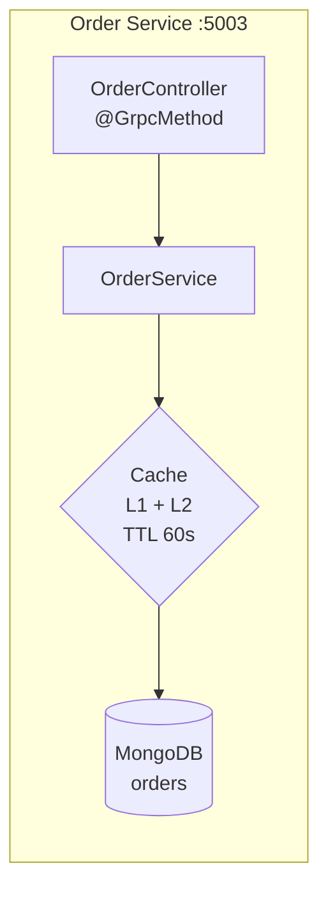

**gRPC Methods:**
| Method | Request | Response | Description |
|--------|---------|----------|-------------|
| `Create` | `CreateOrderRequest` | `Order` | Create order (triggers events downstream) |
| `FindOne` | `OrderById` | `Order` | Get order by ID |
| `FindByUser` | `UserOrders` | `OrderList` | List orders for a user |

**Key Implementation Patterns:**
- Short TTL (60s) to keep order status fresh
- Order creation can be wired to emit `OrderCreatedEvent` for downstream services

**Environment Variables:**
| Var | Default | Description |
|-----|---------|-------------|
| `MONGO_URI` | `mongodb://localhost:27017/orders` | MongoDB connection |
| `REDIS_URL` | `redis://localhost:6379` | Redis for cache |

---

### 5. Notification Service

> Event-driven notification processing with BullMQ async queue.

**Port:** HTTP :3004 | gRPC :5004 (internal :5000)

**nestjs-boot features used:**
- DatabaseModule (MongoDB `notifications` database)
- EventBus (Redis transport, `@OnEvent`)
- Queue (BullMQ, `@Processor` / `@Process`)
- gRPC Server
- Correlation ID
- Health Check

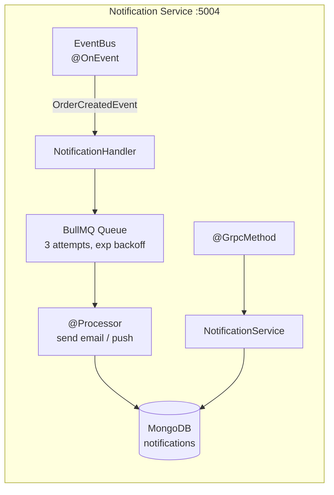

**gRPC Methods:**
| Method | Request | Response | Description |
|--------|---------|----------|-------------|
| `GetNotifications` | `GetNotificationsRequest` | `NotificationList` | List notifications for a user |
| `MarkAsRead` | `MarkAsReadRequest` | `NotificationResponse` | Mark notification as read |

**Key Implementation Patterns:**
- Listens for `OrderCreatedEvent` via EventBus (Redis pub/sub)
- Enqueues notification delivery jobs to BullMQ for async processing
- Queue config: 3 attempts, exponential backoff (1s base), keeps last 100 completed / 500 failed

**Environment Variables:**
| Var | Default | Description |
|-----|---------|-------------|
| `MONGO_URI` | `mongodb://localhost:27017/notifications` | MongoDB connection |
| `REDIS_URL` | `redis://localhost:6379` | Redis for EventBus + BullMQ |

---

### 6. File Service

> File upload and storage with metadata persistence in MongoDB.

**Port:** HTTP :3005 | gRPC :5005

**nestjs-boot features used:**
- DatabaseModule (MongoDB `files` database)
- gRPC Server
- Correlation ID
- Health Check

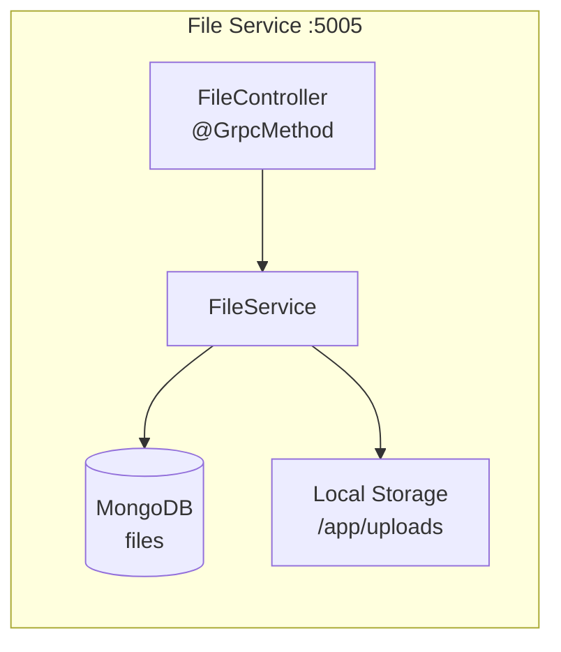

**gRPC Methods:**
| Method | Request | Response | Description |
|--------|---------|----------|-------------|
| `Upload` | `UploadRequest` | `FileResponse` | Upload file, store on disk, save metadata |
| `GetFile` | `FileById` | `FileResponse` | Get file metadata by ID |
| `DeleteFile` | `FileById` | `DeleteResponse` | Delete file from disk + metadata |
| `ListFiles` | `ListFilesRequest` | `FileListResponse` | List uploaded files |

**Key Implementation Patterns:**
- Files stored on disk (Docker volume `file-uploads` at `/app/uploads`)
- Metadata (filename, mimetype, size, URL) persisted in MongoDB
- No Redis dependency -- simple storage service

**Environment Variables:**
| Var | Default | Description |
|-----|---------|-------------|
| `MONGO_URI` | `mongodb://localhost:27017/files` | MongoDB connection |
| `FILE_BASE_URL` | `http://localhost:3005/files` | Public URL prefix for file access |

---

### 7. Scheduler Service

> Cron-like job scheduling with BullMQ repeatable jobs and retry/backoff.

**Port:** HTTP :3006 | gRPC :5006

**nestjs-boot features used:**
- DatabaseModule (MongoDB `scheduler` database)
- CacheModule (L1 + L2 Redis)
- Queue (BullMQ with repeatable jobs)
- gRPC Server
- Correlation ID
- Health Check

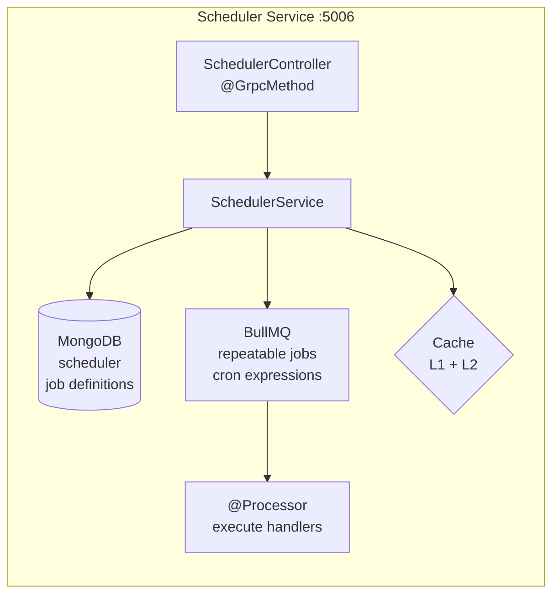

**gRPC Methods:**
| Method | Request | Response | Description |
|--------|---------|----------|-------------|
| `CreateJob` | `CreateJobRequest` | `JobResponse` | Create scheduled job with cron expression |
| `GetJob` | `JobById` | `JobResponse` | Get job definition and status |
| `ListJobs` | `ListJobsRequest` | `JobListResponse` | List all scheduled jobs |
| `PauseJob` | `JobById` | `JobResponse` | Pause a repeatable job |
| `ResumeJob` | `JobById` | `JobResponse` | Resume a paused job |
| `DeleteJob` | `JobById` | `DeleteResponse` | Remove job and its schedule |
| `TriggerJob` | `JobById` | `JobResponse` | Manually trigger a job immediately |

**Key Implementation Patterns:**
- Job definitions stored in MongoDB, execution delegated to BullMQ repeatable queues
- Cron expressions define schedule (e.g., `0 9 * * *` = daily 9am)
- Queue config: 3 attempts, exponential backoff, keeps last 100 completed / 500 failed

**Environment Variables:**
| Var | Default | Description |
|-----|---------|-------------|
| `MONGO_URI` | `mongodb://localhost:27017/scheduler` | MongoDB connection |
| `REDIS_URL` | `redis://localhost:6379` | Redis for cache + BullMQ |

---

### 8. Blog Service

> Blog article management with Redis-cached reads.

**Port:** HTTP :3007 | gRPC :5007

**nestjs-boot features used:**
- DatabaseModule (MongoDB `blog` database)
- CacheModule (L1 + L2 Redis, 300s TTL)
- gRPC Server
- Correlation ID
- Health Check

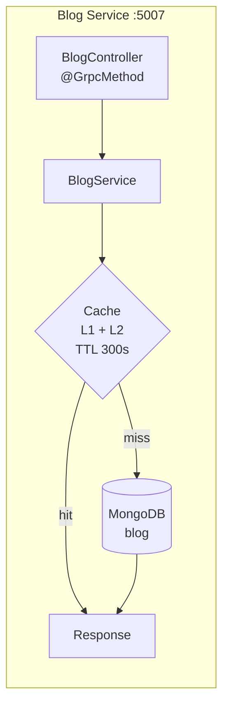

**gRPC Methods:**
| Method | Request | Response | Description |
|--------|---------|----------|-------------|
| `CreateArticle` | `CreateArticleRequest` | `Article` | Create new blog article |
| `UpdateArticle` | `UpdateArticleRequest` | `Article` | Update existing article |
| `GetArticle` | `ArticleBySlug` | `Article` | Get article by slug (cached) |
| `ListArticles` | `ListArticlesRequest` | `ArticleListResponse` | List articles with pagination |
| `DeleteArticle` | `ArticleById` | `DeleteResponse` | Delete article |
| `ListCategories` | `Empty` | `CategoryListResponse` | List all categories |
| `ListTags` | `Empty` | `TagListResponse` | List all tags |

**Key Implementation Patterns:**
- Reads go through cache (300s TTL) for fast article delivery
- Slug-based article lookup for SEO-friendly URLs
- Category and tag aggregation endpoints

**Environment Variables:**
| Var | Default | Description |
|-----|---------|-------------|
| `MONGO_URI` | `mongodb://localhost:27017/blog` | MongoDB connection |
| `REDIS_URL` | `redis://localhost:6379` | Redis for cache |

---

### 9. Fulfillment Service

> Order fulfillment pipeline combining EventBus and BullMQ queue processing.

**Port:** HTTP :3008 | gRPC :5008

**nestjs-boot features used:**
- DatabaseModule (MongoDB `fulfillment` database)
- CacheModule (L1 + L2 Redis, 60s TTL)
- EventBus (Redis transport, `@OnEvent`)
- Queue (BullMQ, `@Processor`)
- gRPC Server
- Correlation ID
- Health Check

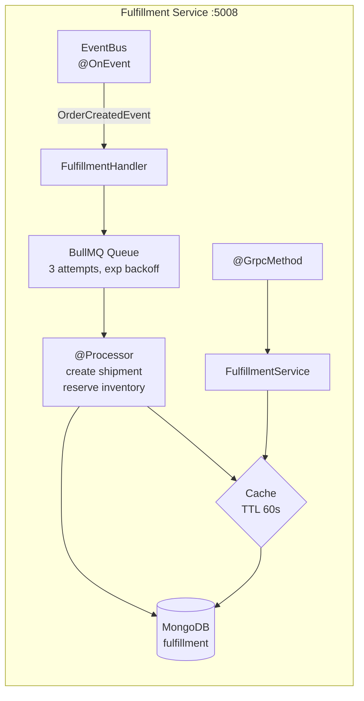

**gRPC Methods:**
| Method | Request | Response | Description |
|--------|---------|----------|-------------|
| `CreateShipment` | `CreateShipmentRequest` | `Shipment` | Manually create a shipment |
| `GetShipment` | `ShipmentById` | `Shipment` | Get shipment by ID |
| `GetShipmentByOrder` | `OrderById` | `Shipment` | Get shipment for an order |
| `UpdateStatus` | `UpdateStatusRequest` | `Shipment` | Update shipment status |
| `ListShipments` | `ListShipmentsRequest` | `ShipmentListResponse` | List all shipments |
| `ReserveInventory` | `ReserveInventoryRequest` | `ReservationResponse` | Reserve inventory for order |
| `ReleaseInventory` | `ReleaseInventoryRequest` | `ReservationResponse` | Release reserved inventory |

**Key Implementation Patterns:**
- Dual input: EventBus for automatic triggers + gRPC for manual control
- Pipeline: event -> queue job -> processor creates shipment + reserves inventory
- Short cache TTL (60s) so fulfillment status stays fresh

**Environment Variables:**
| Var | Default | Description |
|-----|---------|-------------|
| `MONGO_URI` | `mongodb://localhost:27017/fulfillment` | MongoDB connection |
| `REDIS_URL` | `redis://localhost:6379` | Redis for cache + EventBus + BullMQ |

---

### 10. Campaign Service

> Promo campaign management with event-driven lifecycle.

**Port:** HTTP :3009 | gRPC :5009

**nestjs-boot features used:**
- DatabaseModule (MongoDB `campaigns` database)
- CacheModule (L1 + L2 Redis, 300s TTL)
- EventBus (Redis transport, `@OnEvent`)
- gRPC Server
- Correlation ID
- Health Check

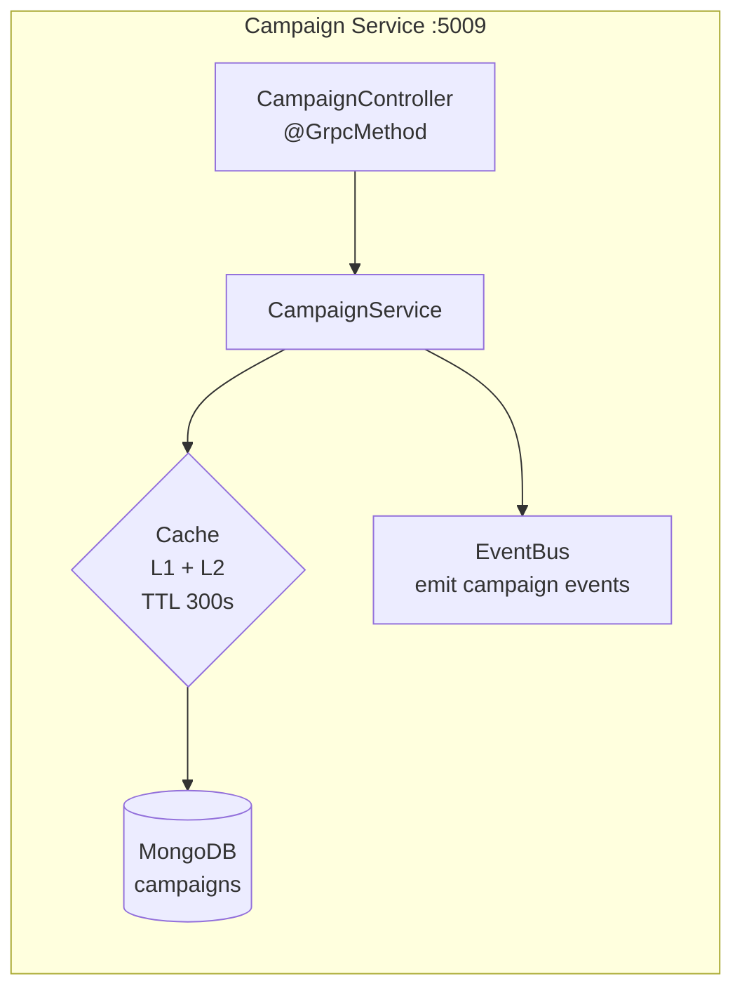

**gRPC Methods:**
| Method | Request | Response | Description |
|--------|---------|----------|-------------|
| `CreateCampaign` | `CreateCampaignRequest` | `Campaign` | Create promo campaign |
| `GetCampaign` | `CampaignById` | `Campaign` | Get campaign by ID |
| `ListCampaigns` | `ListCampaignsRequest` | `CampaignListResponse` | List all campaigns |
| `UpdateCampaign` | `UpdateCampaignRequest` | `Campaign` | Update campaign details |
| `DeleteCampaign` | `CampaignById` | `DeleteResponse` | Delete campaign |
| `ActivateCampaign` | `CampaignById` | `Campaign` | Activate a campaign |
| `DeactivateCampaign` | `CampaignById` | `Campaign` | Deactivate a campaign |
| `ValidatePromoCode` | `ValidatePromoRequest` | `PromoValidationResponse` | Check if promo code is valid |
| `ApplyPromoCode` | `ApplyPromoRequest` | `PromoApplicationResponse` | Apply promo code to order |
| `GetCampaignStats` | `CampaignById` | `CampaignStats` | Get campaign usage statistics |

**Key Implementation Patterns:**
- Campaign lifecycle: create -> activate -> (usage) -> deactivate -> delete
- Promo code validation and application as separate operations
- Events emitted on lifecycle transitions for cross-service awareness
- Campaign data cached (300s) for fast promo validation during checkout

**Environment Variables:**
| Var | Default | Description |
|-----|---------|-------------|
| `MONGO_URI` | `mongodb://localhost:27017/campaigns` | MongoDB connection |
| `REDIS_URL` | `redis://localhost:6379` | Redis for cache + EventBus |

---

## Project Structure

```
examples/microservices/
├── proto/                        # Shared protobuf definitions
│   ├── auth.proto
│   ├── blog.proto
│   ├── campaign.proto
│   ├── file.proto
│   ├── fulfillment.proto
│   ├── notification.proto
│   ├── order.proto
│   ├── product.proto
│   └── scheduler.proto
├── api-gateway/                  # HTTP entry point
│   └── src/
│       ├── main.ts               # createApp() with auth + 9 gRPC clients
│       ├── auth/                 # REST controller + gRPC proxy
│       ├── product/              # REST controller + gRPC proxy
│       ├── order/                # REST controller + gRPC proxy
│       ├── notification/         # REST controller + gRPC proxy
│       ├── file/                 # REST controller + gRPC proxy
│       ├── blog/                 # REST controller + gRPC proxy
│       ├── campaign/             # REST controller + gRPC proxy
│       ├── fulfillment/          # REST controller + gRPC proxy
│       └── scheduler/            # REST controller + gRPC proxy
├── auth-service/                 # gRPC backend — JWT auth
├── product-service/              # gRPC backend — L1+L2 cache
├── order-service/                # gRPC backend — orders
├── notification-service/         # gRPC backend — events + queue
├── file-service/                 # gRPC backend — file upload
├── scheduler-service/            # gRPC backend — cron jobs via BullMQ
├── blog-service/                 # gRPC backend — articles + Redis cache
├── fulfillment-service/          # gRPC backend — order fulfillment pipeline
├── campaign-service/             # gRPC backend — promo campaigns + events
└── docker-compose.yml            # Full stack: 10 services + MongoDB + Redis
```
